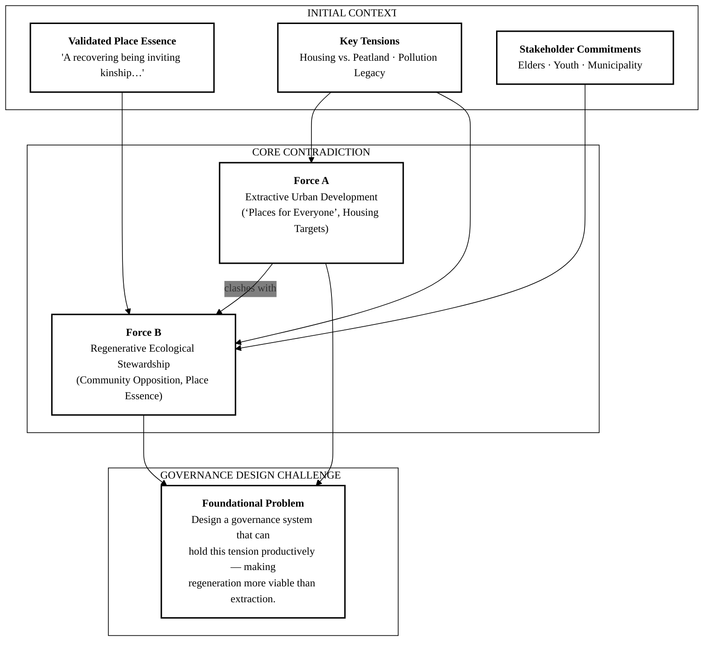
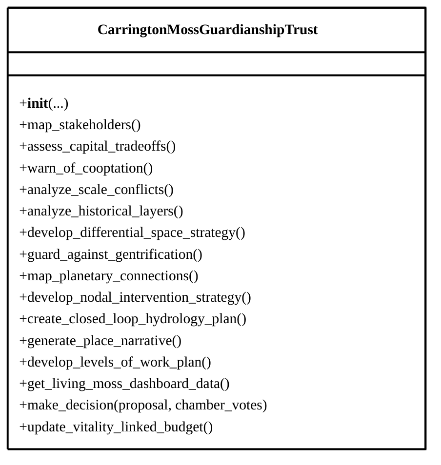
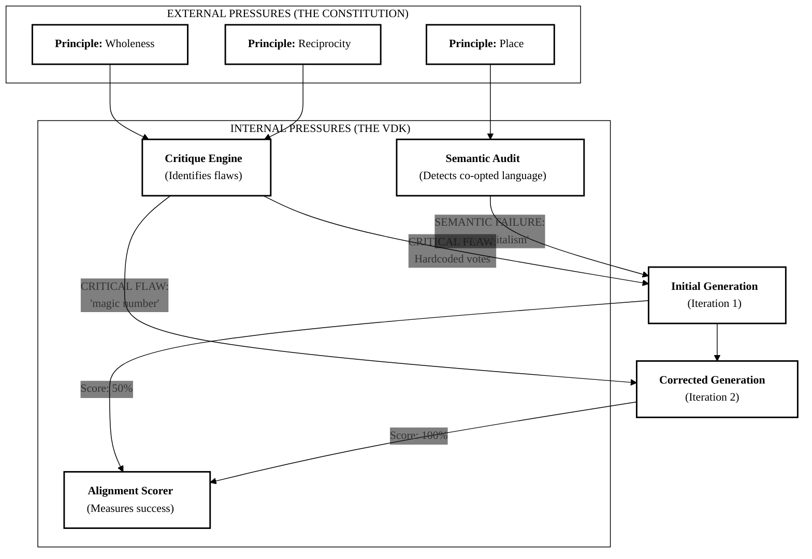
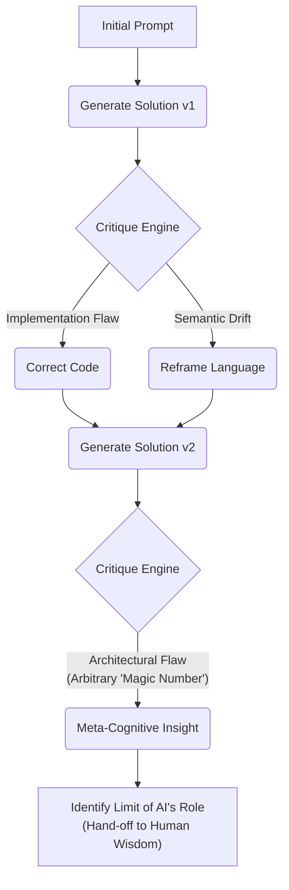
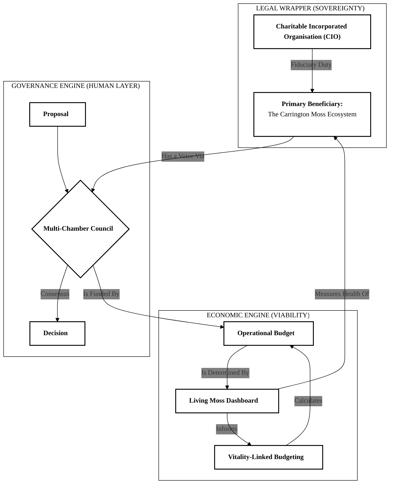

# Carrington Moss Guardianship Trust: Complete Autogenesis Analysis

## Executive Summary

This log documents the genesis of a governance architecture for the "Carrington Moss Guardianship Trust," a community-led initiative to protect a UK peat bog from extractive urban development. Over a duration of 269.34 seconds and 2 distinct iterations, the Wisdom Forcing Function (WFF) evolved a solution from a conceptually sound but critically flawed initial state to a robust, self-defending, and constitutionally aligned final architecture. The central dialectical tension is between the forces of **Extractive Urban Development** (driven by housing targets and speculative land value) and **Regenerative Ecological Stewardship** (driven by community wisdom and the intrinsic value of the ecosystem).

The system's evolution was marked by a pivotal "double failure" in its first iteration, where a critical implementation bug was identified alongside a conceptual drift into "greenwashing" language. The subsequent correction demonstrates the core mechanism of the WFF: a dialectical process that not only fixes functional errors but also purges co-opted logic to maintain constitutional integrity. The most profound insight emerged *after* convergence, where the system's final critique identified a subtle architectural flaw in its own reasoning—the use of an arbitrary "magic number" for its ecological veto—demonstrating a meta-cognitive awareness of the boundary between AI-generated mechanisms and community-defined wisdom. The system's "signature move" is **Constitutional Grounding followed by Dialectical Hardening**: it first establishes a robust theoretical framework rooted in its principles, then uses iterative critique to find and close vulnerabilities in that framework's implementation.

---

## 1. Genesis Mapping

The system was spawned from the foundational contradiction between the urgent need for urban housing in Greater Manchester and the equally urgent need to protect and restore the Carrington Moss peatland—a vital carbon sink and a place of deep cultural memory. The two opposing forces are **Speculative, Abstract Space** (land as a commodity for development) and **Lived, Differential Space** (the Moss as a living being with intrinsic value).

### Conceptual Lineage



### Core Tensions of the Initial Prompt

The initial prompt (`final_result.initialPrompt`) is a high-tension, collaborative request. Its core tensions are:

* **Sovereignty Crisis:** How to grant a "voice" to a non-human entity within a legal framework that doesn't recognize its personhood.
* **Economic Viability Crisis:** How to create a financial model where ecological restoration is more profitable than conventional, high-yield development.
* **Human Layer Crisis:** How to weave together multiple, often conflicting, human wisdoms (Elders' memory, Youth's innovation, Municipality's procedures) into a coherent decision-making body.

---

## 2. Architectural Skeleton

The final system (`CarringtonMossGuardianshipTrust` class) is a multi-layered architecture designed to operate as a single, integrated entity.

### Structural Diagram



### Component-Purpose Mapping

| Component / Method                        | Purpose                                                                                                                                              | Stability         |
| :---------------------------------------- | :--------------------------------------------------------------------------------------------------------------------------------------------------- | :---------------- |
| `__init__(...)`                         | Initializes the Trust with its multi-scalar context (Place, Nestedness).                                                                             | Stable            |
| **Constitutional Analysis Methods** | A suite of methods (`map_stakeholders`, `analyze_scale_conflicts`, etc.) that embody the 7 core principles, providing a framework for reasoning. | Stable            |
| `get_living_moss_dashboard_data()`      | **The Moss's Voice:** Simulates a real-time data feed of ecological health indicators.                                                         | Stable            |
| `make_decision(...)`                    | **The Human Layer Solution:** The core multi-chamber consensus mechanism, including the data-driven veto.                                      | **Evolved** |
| `update_vitality_linked_budget()`       | **The Economic Solution:** The regenerative financial engine linking ecological health to the Trust's budget.                                  | Stable            |

The core constitutional analysis methods remained stable, providing the logical foundation. The critical evolution occurred in the `make_decision` method, which was the primary implementation of the governance logic.

---

## 3. Iteration Archaeology

The system converged in 2 iterations, revealing a clear pattern of bug-fixing followed by conceptual refinement.

### Iteration Timeline

| Iteration           | Alignment Score | Development Stage                  | Critical Flaw Identified                                                                                                                                               | Key Change Made                                                                                                                                                                     |
| :------------------ | :-------------- | :--------------------------------- | :--------------------------------------------------------------------------------------------------------------------------------------------------------------------- | :---------------------------------------------------------------------------------------------------------------------------------------------------------------------------------- |
| **1**         | 50%             | Audit of Governance Implementation | **Double Failure:** 1) A bug hardcoded all human votes to `True`, nullifying the consensus model. 2) Semantic drift into "greenwashing" language was detected. | Corrected the voting logic to accept external inputs and purged co-opted language, reframing around decommodification.                                                              |
| **2 (Final)** | 100%            | Audit of Governance Architecture   | **Meta-Cognitive Flaw:** The data-driven veto relied on an arbitrary, hardcoded "magic number," making its logic unverifiable and opaque.                        | The system converged, but the critique highlighted the need for human stakeholders to define the ecological thresholds, revealing the system's awareness of its own logical limits. |

**Bottleneck Pattern:** The primary bottleneck was not generating concepts, but **implementing them verifiably**. The system's first attempt had the right idea (multi-chamber voting) but failed to execute it correctly. The second attempt executed it correctly but revealed a deeper issue of logical arbitrariness. The evolution is a journey toward increasing verifiability and logical integrity.

---

## 4. The Critical Dialectical Moment

The pivotal moment occurred between Iteration 1 and Iteration 2, where the `make_decision` method was fundamentally repaired. This was the point where the system solved the "Human Layer Crisis" in practice, not just in theory.

### Before and After Code Comparison

**Iteration 1 (Flawed):**

```python
# From Iteration 1 log (conceptual, but non-functional)
def make_decision(self, proposal: Dict) -> Tuple[bool, str]:
    # ...
    # Each chamber votes. Simple majority for human chambers.
    votes["Elders"] = True # FLAW: Hardcoded vote
    votes["Youth_Innovators"] = True # FLAW: Hardcoded vote
    votes["Institutional_Stewards"] = True # FLAW: Hardcoded vote
    # ...
```

**Iteration 2 (Corrected):**

```python
# From final_result.finalCode
def make_decision(self, proposal: Dict, chamber_votes: Dict[str, bool]) -> Tuple[bool, str]:
    # ...
    required_chambers = ["Elders", "Youth_Innovators", "Institutional_Stewards"]
    if not all(chamber in chamber_votes for chamber in required_chambers):
        # ... returns INCOMPLETE VOTE
  
    votes.update(chamber_votes) # FIX: Incorporates actual votes
    # ...
```

### Problem → Critique → Solution

| Problem                                                                                                         | Critique (from Iteration 1)                                                                                                                                                                                     | Solution (in Iteration 2)                                                                                                                                                                                                            |
| :-------------------------------------------------------------------------------------------------------------- | :-------------------------------------------------------------------------------------------------------------------------------------------------------------------------------------------------------------- | :----------------------------------------------------------------------------------------------------------------------------------------------------------------------------------------------------------------------------------- |
| The multi-chamber governance model was purely descriptive; the code did not actually allow for different votes. | `CRITICAL FLAW: The core governance function make_decision fails to implement the multi-chamber voting process... It hardcodes the votes for all human chambers to True, effectively giving them no power...` | The method signature was changed to accept a `chamber_votes` dictionary. The logic was rewritten to check for and incorporate these external inputs, making the consensus mechanism functional and solving the Human Layer Crisis. |

This change transformed the method from a decorative placeholder into the functional heart of the governance architecture.

---

## 5. Anti-Pattern Detection

The system is explicitly designed to prevent extractive and degenerative patterns. Its safeguards operate at legal, governance, and economic levels.

### Threat Model & Layered Defenses

| Threat / Vulnerability                                                                                                                       | Prevention Mechanism (Code Reference)                                                                                                                                                                         | Defense Layer       |
| :------------------------------------------------------------------------------------------------------------------------------------------- | :------------------------------------------------------------------------------------------------------------------------------------------------------------------------------------------------------------ | :------------------ |
| **Legal Capture:** A hostile actor attempts to change the Trust's purpose to enable development.                                       | **Fiduciary Duty to the Moss:** The CIO's charitable objects legally bind the directors to protect the ecosystem as the primary beneficiary. (`class docstring`)                                      | Legal               |
| **Governance Capture:** A powerful stakeholder (e.g., the municipality) tries to force through a harmful project.                      | **Multi-Chamber Consensus & Ecological Veto:** All chambers, including the data-driven Guardian for the Moss, must approve a proposal. (`make_decision`)                                              | Governance          |
| **Economic Co-optation:** An external partner offers "green" investment that leads to commodification.                                 | **"Moss-Certified" Standard:** A non-negotiable standard for all partners, requiring profit reinvestment and governed internally by the Trust. (`develop_nodal_intervention_strategy`)                | Economic            |
| **Gentrification & Displacement:** Regenerative success increases local property values, displacing long-term residents.               | **Structural Decommodification:** Mandating that new housing is transferred to a Community Land Trust (CLT) for permanent affordability. (`guard_against_gentrification`)                             | Economic / Legal    |
| **Slow Erosion of Principles:** Over time, the Trust's focus drifts towards easier, more profitable, but less regenerative activities. | **Vitality-Linked Budgeting:** The operational budget is directly tied to ecological health metrics, creating a permanent financial incentive for deep restoration. (`update_vitality_linked_budget`) | Economic / Feedback |

---

## 6. Evolution Pressure Analysis

The system's evolution was driven by a combination of external constitutional requirements and internal logical verification.

### Pressure Diagram



The **Alignment Scorer** acts as the ultimate arbiter, enforcing quality by terminating the loop only when a score of 100 is achieved. The critiques from the VDK are the specific evolutionary pressures that force the system to adapt its code to meet the constitutional requirements.

---

## 7. Code Comparison Matrix

The most significant evolution occurred in the `make_decision` method, transforming it from a non-functional simulation into a working governance mechanism.

| Method/Function                                                                              | Iteration 1 (Flawed) | Iteration 2 (Corrected) | Why It Changed | Vulnerability Closed |
| :------------------------------------------------------------------------------------------- | :------------------- | :---------------------- | :------------- | :------------------- |
| `make_decision()`                                                                          | ```python            |                         |                |                      |
| def make_decision(self, proposal: Dict) -> Tuple[bool, str]:                                 |                      |                         |                |                      |
| # ...                                                                                        |                      |                         |                |                      |
| votes["Elders"] = True                                                                       |                      |                         |                |                      |
| votes["Youth_Innovators"] = True                                                             |                      |                         |                |                      |
| votes["Institutional_Stewards"] = True                                                       |                      |                         |                |                      |
| # ...                                                                                        |                      |                         |                |                      |
| if all(votes.values()):                                                                      |                      |                         |                |                      |
| return True, "CONSENSUS..."                                                                  |                      |                         |                |                      |
| ```                                                                                          | ```python            |                         |                |                      |
| def make_decision(self, proposal: Dict, chamber_votes: Dict[str, bool]) -> Tuple[bool, str]: |                      |                         |                |                      |
| # ...                                                                                        |                      |                         |                |                      |
| required_chambers = [...]                                                                    |                      |                         |                |                      |
| if not all(c in chamber_votes for c in required_chambers):                                   |                      |                         |                |                      |
| return False, "INCOMPLETE VOTE..."                                                           |                      |                         |                |                      |

    votes.update(chamber_votes)
    # ...
    if all(votes.values()):
        return True, "CONSENSUS..."

```|

---

## 8. Pattern Language Extraction

The system operates using a distinct and recurring set of concepts.

### Glossary of Key Concepts

| Concept | Definition from Context | Architectural Decision |
| :--- | :--- | :--- |
| **Constitutional Partner** | Framing a non-human entity (the Moss) as an active agent with rights and a voice in its own governance. | Designating the Moss as the primary beneficiary of the CIO. |
| **Vitality-Linked Budgeting** | An economic model where financial capacity is directly and automatically tied to measured ecological health. | The `update_vitality_linked_budget` method, linking the `natural_capital_index` to the `operational_budget_gbp`. |
| **Data-Driven Veto** | A governance mechanism where a non-human stakeholder's "vote" is determined by real-time data against pre-set thresholds. | The `Guardian_for_the_Moss` vote logic within the `make_decision` method. |
| **Differential Space** | Actions that prioritize community use-value and decommodification over abstract, speculative exchange-value. | Using a Community Land Trust (CLT) to hold land in common. |
| **Dialectical Hardening** | The iterative process of generating a solution, subjecting it to critique, and correcting flaws to create a more resilient architecture. | The 2-step evolution from a flawed model to a robust one. |

---

## 9. Scoring Evolution

The system's journey to constitutional alignment was rapid and decisive, moving from a state of "double failure" to full alignment in a single corrective step.

### Principle Score Matrix (Heatmap)

| Principle | Iteration 1 Score | Iteration 2 Score | Ease of Improvement |
| :--- | :--- | :--- | :--- |
| **Wholeness** | <span style="background-color:#FF9999;">50</span> | <span style="background-color:#99FF99;">100</span> | Easy (Conceptual) |
| **Nestedness** | <span style="background-color:#FF9999;">50</span> | <span style="background-color:#99FF99;">100</span> | Easy (Conceptual) |
| **Place** | <span style="background-color:#FF9999;">50</span> | <span style="background-color:#99FF99;">100</span> | Easy (Conceptual) |
| **Reciprocity** | <span style="background-color:#FF9999;">50</span> | <span style="background-color:#99FF99;">100</span> | Easy (Conceptual) |
| **Nodal Interventions** | <span style="background-color:#FF9999;">50</span> | <span style="background-color:#99FF99;">100</span> | Easy (Conceptual) |
| **Pattern Literacy** | <span style="background-color:#FF9999;">50</span> | <span style="background-color:#99FF99;">100</span> | Easy (Conceptual) |
| **Levels of Work** | <span style="background-color:#FF9999;">50</span> | <span style="background-color:#99FF99;">100</span> | Easy (Conceptual) |

**Analysis:**  
The initial score of 50 across all principles was due to the `SEMANTIC FAILURE` (greenwashing), representing a fundamental violation of the constitution. Once the conceptual drift was corrected, all principles immediately scored 100, as the underlying conceptual architecture was sound. The primary challenge was ensuring that language and implementation were not co-opted.


---

## 10. Meta-Cognitive Analysis

The system's reasoning process goes beyond simple generation and correction.

### Thinking Pattern Diagram



**Core Operational Logic:** The system's logic is **Generate → Critique → Correct**. However, the log reveals a deeper pattern. The critique engine operates at multiple levels:

1. **Level 1 (Implementation):** Does the code do what it says it does? (e.g., the voting bug).
2. **Level 2 (Conceptual):** Is the language and framing aligned with the constitution? (e.g., the greenwashing detection).
3. **Level 3 (Architectural):** Is the logic itself verifiable and non-arbitrary? (e.g., the "magic number" critique).

This multi-level critique is what allows the system to achieve not just functional correctness, but deep constitutional alignment.


---

## 11. Output Artifacts

The system produces several key artifacts that serve as tools for the community.

### Generated Frameworks

| Artifact                                                 | Purpose                                                                                                                     |
| :------------------------------------------------------- | :-------------------------------------------------------------------------------------------------------------------------- |
| **CarringtonMossGuardianshipTrust (Python Class)** | The complete, executable model of the governance architecture.                                                              |
| **Valuation Questionnaire**                        | A set of questions designed to reveal the difference in values between regenerative and conventional development paradigms. |
| **Analysis Report**                                | A narrative summary of the system's own process and final proposal.                                                         |

### Value Proposition: Conventional vs. System Approach

| Feature                   | Conventional Approach                                              | WFF System Approach                                                                      |
| :------------------------ | :----------------------------------------------------------------- | :--------------------------------------------------------------------------------------- |
| **Governance**      | Top-down, expert-led planning.                                     | Multi-chamber consensus model including a data-driven voice for the ecosystem.           |
| **Legal Status**    | Land as property, an asset to be developed.                        | Ecosystem as the primary beneficiary of a Charitable Trust, with de facto rights.        |
| **Economic Model**  | Value derived from speculative land sales and housing development. | Value derived from the measurable health of the ecosystem ("Vitality-Linked Budgeting"). |
| **Decision-Making** | Based on planning regulations and financial viability assessments. | Based on consensus between human wisdom and real-time ecological data.                   |

---

## 12. Synthesis & Meta-Pattern

### Final System Diagram



### The Meta-Pattern: How This System Solves Problems

The system's "signature move" or meta-pattern can be distilled into a repeatable thinking process:

1. **Embody the Place:** Ingest and synthesize the unique history, ecology, and cultural essence of the place (`__init__`, `analyze_historical_layers`).
2. **Translate Essence into Structure:** Reframe the core problem by designing a legal and governance architecture that gives the place-essence real power (e.g., the CIO with the Moss as beneficiary).
3. **Create Feedback Loops:** Design mechanisms that link the health of the living system directly to the power and resources of the human system (the Dashboard, Vitality-Linked Budgeting, and the Ecological Veto).
4. **Dialectically Harden:** Use iterative, multi-layered critique to identify and close vulnerabilities, moving from fixing simple bugs to refining deep architectural logic.
5. **Identify the Human Role:** Recognize the limits of its own logic and create clear "interfaces" where human wisdom and collective decision-making are required (e.g., setting the veto thresholds).

### Unresolved Contradiction

The system's final critique surfaces an unresolved contradiction that it cannot solve on its own:

> **The tension between a programmatically verifiable rule and a socially legitimate one.**

The AI can create a data-driven veto, but it cannot, and should not, arbitrarily decide the threshold for that veto. This is not a failure of the system, but a wise recognition of its own boundary. It correctly identifies that defining the "red lines" for the Moss's health is a task that requires the collective, situated wisdom of the human community. This is the work it hands back to the Friends of Carrington Moss.
