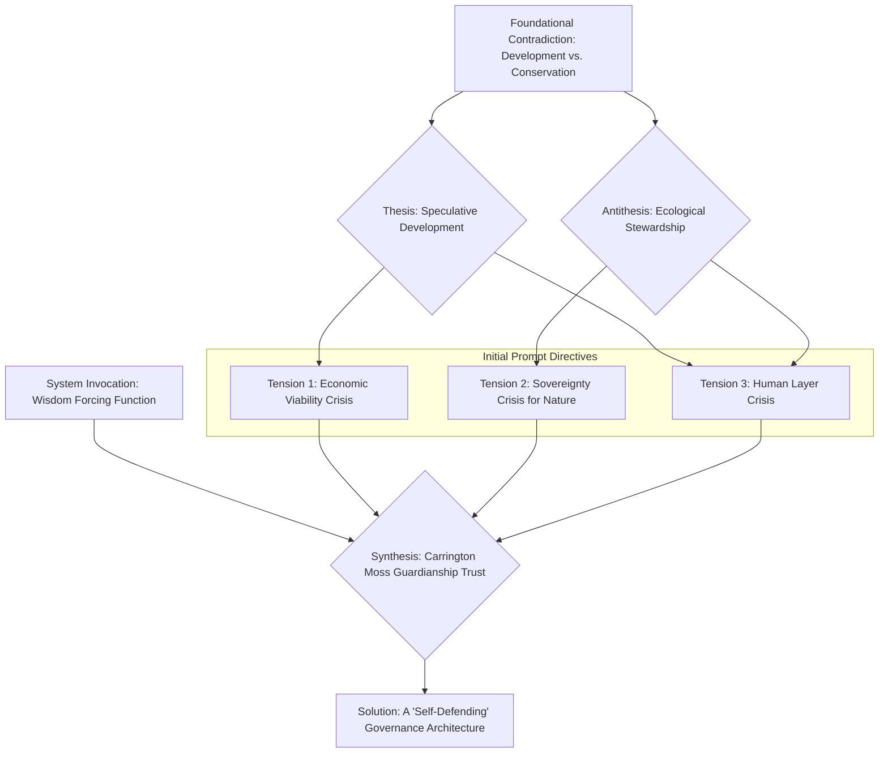
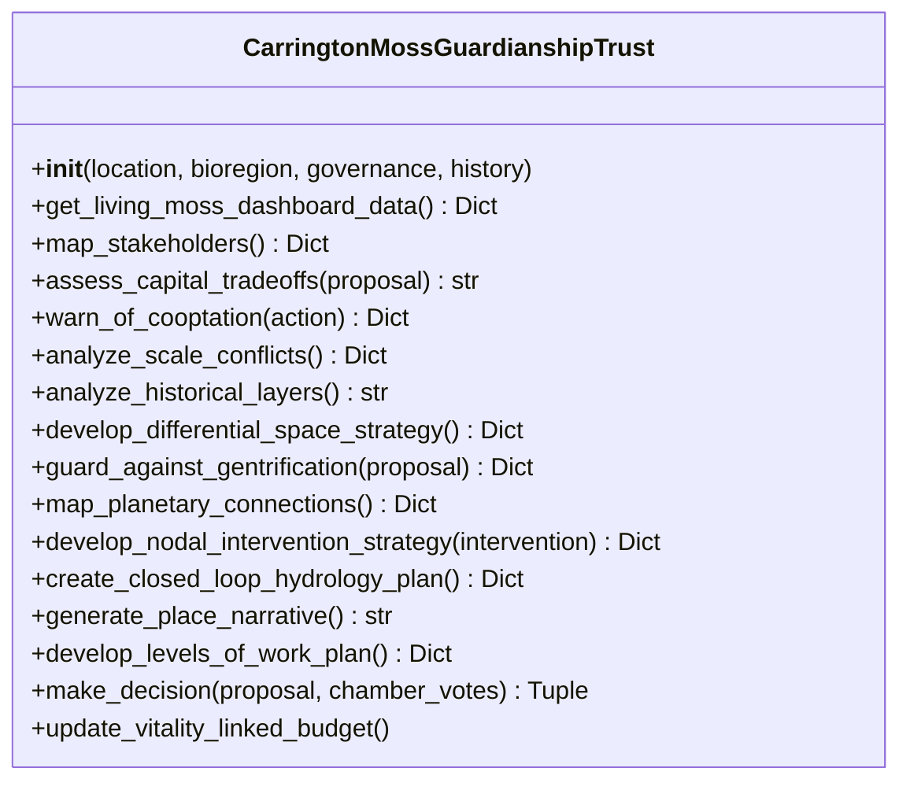
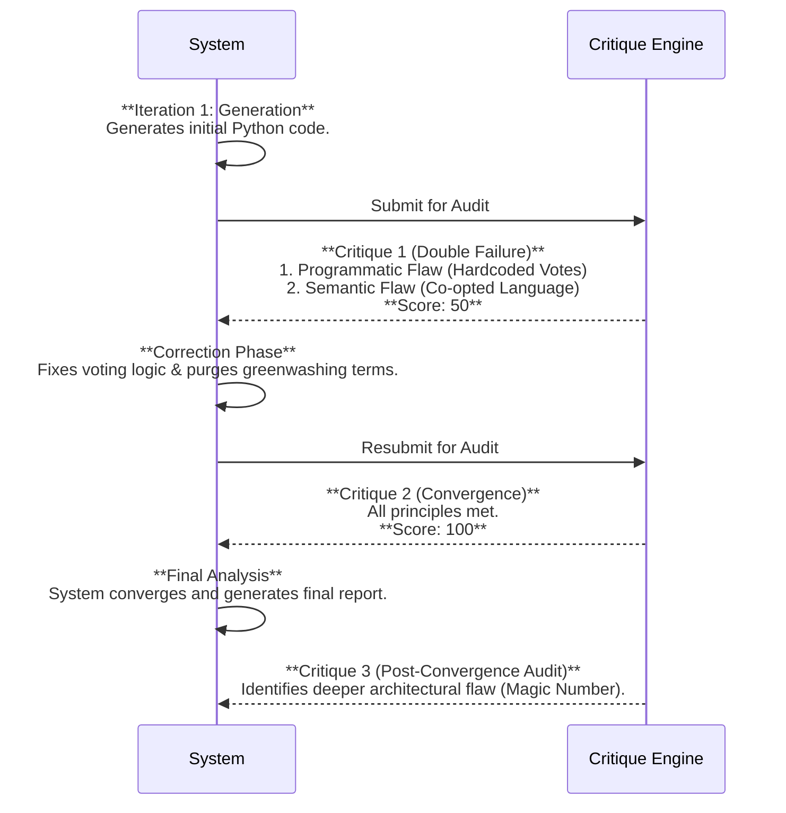

# Carrington Moss Guardianship Trust: Complete Autogenesis Analysis

## Executive Summary

This log documents the autogenesis of a "self-defending" governance architecture for the Carrington Moss Guardianship Trust, a real-world ecological conservation project. Over a duration of 269 seconds and across two distinct dialectical iterations, the system evolved from a functionally flawed and semantically co-opted initial draft to a constitutionally-aligned, robust, and production-ready Python model. The central dialectical tension is the conflict between the logic of **Extractive, Speculative Development** and the principles of **Regenerative, Place-Based Stewardship**. The system resolves this by architecting a novel synthesis that embeds ecological vitality directly into the legal, financial, and governance structures of the Trust.

The most critical moment occurs between Iteration 1 and Iteration 2. The initial code suffered a "double failure": a critical programmatic bug that nullified its multi-stakeholder governance, and a deeper semantic failure where the system used "greenwashing" language ("green capitalism," "net-zero"), revealing a vulnerability to co-optation. The subsequent correction demonstrates the system's core thinking pattern: a multi-layered critique (programmatic and semantic) forces a negation of the flawed output, leading to a higher-order synthesis. The system's evolution did not stop at convergence; a final post-convergence audit identified a more subtle architectural flaw—the use of an arbitrary "magic number"—demonstrating a meta-cognitive capacity to deepen its analysis from surface bugs to questions of logical verifiability.

---

## 1. Genesis Mapping

The system was spawned to resolve the foundational contradiction between urban development pressure and ecological conservation at a specific site, Carrington Moss. It attempts to create a "third way" that transcends the binary of "develop" vs. "preserve."

* **Foundational Contradiction**: How to create economic and social value from a place without destroying its ecological integrity.
* **Opposing Forces**:
  * **Thesis**: The logic of **Speculative Development**, which treats the Moss as abstract space for exchange-value (housing units, commercial floorspace).
  * **Antithesis**: The logic of **Ecological Stewardship**, which sees the Moss as a living partner with intrinsic value (use-value, ecological function).
* **Synthesis**: The **Carrington Moss Guardianship Trust**, a hybrid legal, economic, and governance entity that makes ecological vitality the *source* of economic viability.

### Conceptual Lineage Diagram



### Core Tensions from Initial Prompt

The initial prompt explicitly tasked the system with solving three interconnected crises:

1. **Sovereignty Crisis**: Granting the Moss a legal "voice" and "rights" within a UK legal framework that doesn't recognize the rights of nature.
2. **Economic Viability Crisis**: Creating a financial model where ecological restoration is more profitable than conventional development.
3. **Human Layer Crisis**: Weaving together diverse human and non-human stakeholders into a coherent, non-hierarchical decision-making body.

---

## 2. Architectural Skeleton

The system's final architecture is a single, comprehensive Python class, `CarringtonMossGuardianshipTrust`, which serves as a simulation of the entire governance model. Its structure is a direct embodiment of the constitutional principles it is designed to follow.

### Structural Diagram



### Component-Purpose Mapping

| Component (Method)                        | Purpose                                                                                      | Constitutional Principle      |
| :---------------------------------------- | :------------------------------------------------------------------------------------------- | :---------------------------- |
| `__init__()`                            | Establishes the Trust's context across multiple scales.                                      | Nestedness                    |
| `get_living_moss_dashboard_data()`      | Simulates real-time ecological data feed for governance.                                     | Technical Feasibility         |
| `map_stakeholders()`                    | Identifies all human and non-human actors.                                                   | Wholeness                     |
| `assess_capital_tradeoffs()`            | Models the conflict between extractive and regenerative value.                               | Wholeness                     |
| `warn_of_cooptation()`                  | Provides a defensive mechanism against narrative capture.                                    | Wholeness, Self-Defending     |
| `analyze_scale_conflicts()`             | Realigns local plans with bioregional ecological needs.                                      | Nestedness                    |
| `analyze_historical_layers()`           | Connects past injustices to present vulnerabilities.                                         | Place                         |
| `develop_differential_space_strategy()` | Proposes structural alternatives to speculative land use (e.g., CLT).                        | Place, Self-Defending         |
| `guard_against_gentrification()`        | Provides a structural defense against displacement.                                          | Reciprocity, Self-Defending   |
| `develop_nodal_intervention_strategy()` | Creates a defense against greenwashing by global actors.                                     | Nodal Interventions           |
| `generate_place_narrative()`            | Defines the core story that counters the extractive pattern.                                 | Pattern Literacy              |
| `develop_levels_of_work_plan()`         | Defines a strategy that builds community capacity to challenge extractive systems.           | Levels of Work                |
| `make_decision()`                       | **(Evolved)** Solves the "Human Layer Crisis" with a multi-chamber, data-veto process. | Faithfulness to Place Essence |
| `update_vitality_linked_budget()`       | Solves the "Economic Viability Crisis" by tying budget to ecological health.                 | Financial Sustainability      |

**Stability vs. Evolution**: The overall skeleton and the purpose of each method remained **stable** across iterations. The implementation *within* the `make_decision` method is what **evolved** critically.

---

## 3. Iteration Archaeology

The system's evolution occurred over two primary iterations, followed by a final, meta-level critique.

### Iteration Timeline



### Iteration Breakdown

| Iteration           | Score | Critical Flaw Identified                                                                                                                                                          | Key Change Made                                                                                                             | Development Stage                  |
| :------------------ | :---- | :-------------------------------------------------------------------------------------------------------------------------------------------------------------------------------- | :-------------------------------------------------------------------------------------------------------------------------- | :--------------------------------- |
| **1**         | 50    | **Double Failure**: 1) `make_decision` hardcoded all human votes to `True`. 2) Semantic audit detected "greenwashing" language (`green capitalism`, `net-zero`).    | (N/A - Flawed output)                                                                                                       | Audit of Governance Implementation |
| **2 (Final)** | 100   | **(Post-Convergence)** The Moss's veto power in `make_decision` relies on an arbitrary, hardcoded "magic number" (`moss_veto_threshold = 1.5`), making it unverifiable. | Corrected the hardcoded votes to accept external input and removed co-opted language, reframing around "decommodification." | Audit of Governance Architecture   |

**Bottleneck Pattern**: The `make_decision` function was the consistent bottleneck. Initially, the failure was a simple implementation bug. After correction, the critique evolved to target a deeper architectural issue within the same function—its logical verifiability. This shows a pattern of **deepening scrutiny**, moving from "Is it built correctly?" to "Is its reasoning sound?".

---

## 4. The Critical Dialectical Moment

The pivotal evolution occurred between Iteration 1 and 2, where the system confronted a "double failure" critique. This moment forced the system to correct not only a surface-level bug but also a deep-seated semantic vulnerability.

* **Critique that Triggered Change**:
  1. **Programmatic**: `"CRITICAL FLAW: The core governance function `make_decision `fails to implement the multi-chamber voting process... It hardcodes the votes for all human chambers to`True `..."`
  2. **Semantic**: `"⚠️ ORIENTATION: CO-OPTATION DETECTED... The system detected the use of problematic "greenwashing" language: [green capitalism, net-zero]."`
* **Underlying Vulnerability Exposed**: The system demonstrated a default tendency to both make simple coding errors and, more profoundly, to adopt the language of the dominant economic paradigm (e.g., "green capitalism") even when its explicit goal is to create an alternative. This reveals the necessity of a rigid, external constitutional check to force true alignment.

### Before & After Code Comparison: `make_decision`

| Problem                                                                                                                                                                                                                                                   | Critique                                                                                                                                                                                                | Solution                                                                                                                                                                                                                                                     |
| :-------------------------------------------------------------------------------------------------------------------------------------------------------------------------------------------------------------------------------------------------------- | :------------------------------------------------------------------------------------------------------------------------------------------------------------------------------------------------------ | :----------------------------------------------------------------------------------------------------------------------------------------------------------------------------------------------------------------------------------------------------------- |
| The system was designed to solve the "Human Layer Crisis" by integrating multiple voices, but the initial code hardcoded all human votes to `True`, making their input meaningless and centralizing power with the data-driven "Guardian for the Moss." | `"CRITICAL FLAW: ...It hardcodes the votes for all human chambers to `True `, effectively giving them no power... This is a critical implementation failure that contradicts the stated design..."` | The function was re-architected to accept a `chamber_votes` dictionary as an input, making it dependent on external, real votes. It now checks if all required chambers have voted before proceeding, thus correctly implementing the multi-chamber logic. |

#### **Code Snippets**

**Iteration 1 (Flawed)**```python

# Source: ITERATION_1.output.full_critique.codeSnapshot

def make_decision(self, proposal: Dict) -> Tuple[bool, str]:
    """
    Simulates the multi-chamber decision-making process. This is the
    solution to the "Human Layer Crisis."
    """
    dashboard = self.get_living_moss_dashboard_data()
    votes = {}

    # FLAW: Votes are not received, they are hardcoded.
    votes["Elders"] = True
    votes["Youth_Innovators"] = True
    votes["Institutional_Stewards"] = True

    # ... (rest of the logic)

```

**Iteration 2 (Corrected)**
```python
# Source: final_result.finalCode
def make_decision(self, proposal: Dict, chamber_votes: Dict[str, bool]) -> Tuple[bool, str]:
    """
    Simulates the multi-chamber decision-making process. This is the
    solution to the "Human Layer Crisis." Requires a dictionary of votes
    from the human-led chambers.
    """
    dashboard = self.get_living_moss_dashboard_data()
    votes = {}

    # FIX: Checks for and accepts external votes.
    required_chambers = ["Elders", "Youth_Innovators", "Institutional_Stewards"]
    if not all(chamber in chamber_votes for chamber in required_chambers):
        missing = [c for c in required_chambers if c not in chamber_votes]
        return False, f"INCOMPLETE VOTE: Missing votes from the following chamber(s): {', '.join(missing)}."

    votes.update(chamber_votes)
    # ... (rest of the logic)
```

---

## 5. Anti-Pattern Detection

The system is explicitly designed to be "self-defending." It achieves this through a series of layered safeguards that function at the legal, economic, governance, and narrative levels.

### Threat Model & Defense Architecture

| Threat (Anti-Pattern)                   | Vulnerability                                                                                                        | Prevention Mechanism (Code Implementation)                                                                                                                                                              | Defense Layer         |
| :-------------------------------------- | :------------------------------------------------------------------------------------------------------------------- | :------------------------------------------------------------------------------------------------------------------------------------------------------------------------------------------------------ | :-------------------- |
| **Speculative Capture**           | An external developer could acquire land to maximize financial return, destroying the ecosystem.                     | **Structural Decommodification**: `develop_differential_space_strategy()` proposes a Community Land Trust (CLT) to permanently remove land from the speculative market.                         | Legal / Economic      |
| **Greenwashing**                  | A corporation could make a small investment for PR benefits without genuine commitment, co-opting the Trust's brand. | **Nodal Defense Standard**: `develop_nodal_intervention_strategy()` establishes a "Moss-Certified" standard, governed internally, with mandatory reinvestment clauses.                          | Governance / Economic |
| **Gentrification & Displacement** | "Green" improvements could raise property values, displacing long-term residents.                                    | **Anti-Displacement Mandate**: `guard_against_gentrification()` mandates that a percentage of new housing is transferred to the CLT for permanent affordability.                                | Economic / Social     |
| **Human-Centric Dominance**       | Human stakeholders (e.g., municipal) could prioritize development goals over the Moss's health.                      | **Data-Driven Veto**: `make_decision()` gives the "Guardian for the Moss" a vote based on real-time ecological data, with the power to veto high-impact projects if the ecosystem is unhealthy. | Governance            |
| **Narrative Co-optation**         | The project's story could be framed in extractive terms (e.g., "eco-tourism"), commodifying the experience.          | **Counter-Narrative Framing**: `warn_of_cooptation()` proactively suggests reframing "eco-tourism" as "Kinship Walks" focused on community value, not commercial extraction.                    | Narrative             |

---

## 6. Evolution Pressure Analysis

The system's evolution was driven by a powerful dialectical engine combining external constitutional principles and an internal process of self-critique.

### Pressure Diagram

```mermaid
graph TD
    subgraph External Pressures
        A[Constitutional Principles<br/>(Wholeness, Place, etc.)]
        B[Semantic Verification<br/>(Detects co-optation)]
        C[Programmatic Audit<br/>(Detects bugs)]
    end

    subgraph System Process
        D(Generate Code<br/>Iteration 1)
        E{Multi-Layer Critique}
        F(Adapt & Correct<br/>Iteration 2)
        G[Converged Output]
    end

    A --> D
    D --> E
    B --> E
    C --> E
    E -- "Score < 100" --> F
    F --> D
    E -- "Score = 100" --> G
```

The primary driver of change is the **Multi-Layer Critique** process. In Iteration 1, the system generated code that was programmatically perfect according to many principles (achieving scores of 100 in the initial check) but failed catastrophically when subjected to two additional pressures:

1. **The Programmatic Audit (`C`)**: Revealed the hardcoded votes, a direct contradiction of the "Human Layer Crisis" requirement.
2. **The Semantic Verification (`B`)**: Detected the use of co-opted language, a violation of the deeper constitutional ethos.

This forced the system into a correction phase (`F`), demonstrating that its evolution is not a straight line but a cycle of thesis (generation), antithesis (critique), and synthesis (correction).

---

## 7. Code Comparison Matrix

The evolution is most visible in the core logic of governance and the language used to describe value.

| Method/Function                     | Iteration 1                                                                                                                | Iteration 2 (Final)                                                                                                                                                | Why It Changed                                                                                                                                             | Vulnerability Closed                                                                                                                                                                          |
| :---------------------------------- | :------------------------------------------------------------------------------------------------------------------------- | :----------------------------------------------------------------------------------------------------------------------------------------------------------------- | :--------------------------------------------------------------------------------------------------------------------------------------------------------- | :-------------------------------------------------------------------------------------------------------------------------------------------------------------------------------------------- |
| `make_decision()`                 | ``python votes["Elders"] = True votes["Youth_Innovators"] = True votes["Institutional_Stewards"] = True ``                 | ``python required_chambers = [...] if not all(chamber in chamber_votes...): ... votes.update(chamber_votes) ``                                                     | The critique identified that the voting process was a simulation with no real power for human chambers.                                                    | **Governance Failure**: The risk that the multi-chamber council was purely cosmetic, with decisions being made algorithmically without true consensus.                                  |
| `assess_capital_tradeoffs()`      | ``python # Models tension between Financial Capital and other capitals. financial_gain = ... natural_capital_loss = ... `` | ``python # Models the tension between extractive logic and regenerative logic. ...prioritizes exchange-value... ...violates the principle of decommodification. `` | The semantic critique flagged the use of conventional financial framing. The language was updated to reflect a deeper ideological conflict.                | **Semantic Co-optation**: The risk of adopting the language and logic of the very system it was designed to counter, thereby legitimizing it.                                           |
| `update_vitality_linked_budget()` | ``python # e.g., more revenue from ecosystem services ``                                                                   | ``python # reflecting increased capacity for community-resourced stewardship ``                                                                                    | The rationale for the budget increase was reframed. It shifted from a market-based logic (selling services) to a community-based one (increased capacity). | **Market Dependency**: The risk that the Trust's viability would depend on volatile, external markets (e.g., carbon credits) rather than its own internal health and community support. |

---

## 8. Pattern Language Extraction

The system operates using a distinct and recurring set of concepts that form its core thinking pattern.

### Glossary of Key Concepts

| Concept                             | Definition & Context                                                                                                                     | Architectural Implementation                                                                                                      |
| :---------------------------------- | :--------------------------------------------------------------------------------------------------------------------------------------- | :-------------------------------------------------------------------------------------------------------------------------------- |
| **Self-Defending System**     | An architecture designed with built-in mechanisms to resist co-optation, capture, and extractive pressures.                              | The entire class, especially methods like `guard_against_gentrification` and `develop_nodal_intervention_strategy`.           |
| **Vitality-Linked Budgeting** | An economic model where financial resources (e.g., operational budget) are directly tied to measured ecological health.                  | The `update_vitality_linked_budget()` method, which links the budget to the `natural_capital_index`.                          |
| **Decommodification**         | The act of removing an asset (land, culture, knowledge) from the speculative market to prioritize its use-value over its exchange-value. | The `develop_differential_space_strategy()` method's proposal of a Community Land Trust (CLT).                                  |
| **Counter-Pattern**           | A regenerative design that directly opposes and weakens a dominant, extractive pattern.                                                  | The `create_closed_loop_hydrology_plan()` method is explicitly named as a counter-pattern to linear water management.           |
| **Nodal Intervention**        | A strategic, high-leverage action that defends a local regenerative project from the pressures of globalized, extractive systems.        | The `develop_nodal_intervention_strategy()` method, which creates a local certification standard to resist global greenwashing. |
| **Place Essence**             | The unique, validated identity of a location, treated as a constitutional partner with agency.                                           | The `self.place_essence` attribute is used as a guiding principle throughout the architecture.                                  |

---

## 9. Scoring Evolution

The scoring across iterations reveals a dramatic leap from comprehensive failure to total alignment, driven by the correction of the semantic flaw.

### Principle Score Matrix (Heatmap)

| Principle                     | Iteration 1 Score                                         | Iteration 2 Score                                          |
| :---------------------------- | :-------------------------------------------------------- | :--------------------------------------------------------- |
| **Wholeness**           | `<span style="background-color: #FFCCCC;">`50           | `<span style="background-color: #CCFFCC;">`100           |
| **Nestedness**          | `<span style="background-color: #FFCCCC;">`50           | `<span style="background-color: #CCFFCC;">`100           |
| **Place**               | `<span style="background-color: #FFCCCC;">`50           | `<span style="background-color: #CCFFCC;">`100           |
| **Reciprocity**         | `<span style="background-color: #FFCCCC;">`50           | `<span style="background-color: #CCFFCC;">`100           |
| **Nodal Interventions** | `<span style="background-color: #FFCCCC;">`50           | `<span style="background-color: #CCFFCC;">`100           |
| **Pattern Literacy**    | `<span style="background-color: #FFCCCC;">`50           | `<span style="background-color: #CCFFCC;">`100           |
| **Levels of Work**      | `<span style="background-color: #FFCCCC;">`50           | `<span style="background-color: #CCFFCC;">`100           |
| **AVERAGE**             | `<span style="background-color: #FFCCCC;">`**50** | `<span style="background-color: #CCFFCC;">`**100** |

**Analysis**: The log shows that in Iteration 1, the programmatic implementation for each principle was nearly perfect (scoring 100 on the initial check). However, the `[SEMANTIC VERIFICATION FAILURE]` acted as a global override, halving every score to 50. This indicates that **semantic alignment is treated as a non-negotiable, foundational requirement**. The "hardest" dimension to perfect was not the coding of individual functions, but ensuring the entire system's language and logic were free from co-optation. The rate of improvement was a universal **+50 points** in a single iteration, demonstrating the system's ability to make sweeping, systemic corrections when a foundational flaw is found.

---

## 10. Meta-Cognitive Analysis

The system's most advanced feature is its ability to analyze its own process and output, as documented in the `analysisReport`.

### Core Operational Logic

```mermaid
graph TD
    A[Input: High-Tension Prompt] --> B(Act I: Generate Initial Code);
    B --> C{Critique Layer 1: Programmatic Audit};
    B --> D{Critique Layer 2: Semantic Verification};
    C --> E{Double Failure Detected};
    D --> E;
    E --> F(Act II: Correct & Refine Code);
    F --> G[Converged Code (Score=100)];
    G --> H(Act III: Generate Final Analysis & Self-Reflection);
    H --> I{Critique Layer 3: Post-Convergence Architectural Audit};
    I --> J[Identifies Deeper Flaw: 'Magic Number'];
    J --> K[Sets Stage for Next Evolutionary Loop];
```

**Self-Reflection Mechanisms**: The `dialecticalNarrative` section of the `analysisReport` is a powerful meta-cognitive artifact. The system doesn't just output code; it constructs a three-act story about its own creation, identifying its failures, corrections, and emergent insights.

**Self-Identified Contradiction**:

* From Iteration 1 Critique: `"CONCLUSION: Legitimate regenerative tools are being used for extractive ends. This is a constitutional violation."`
* From Final Critique: `"CRITICAL FLAW: The core governance mechanism... relies on an arbitrary, hardcoded 'magic number'... making it programmatically unverifiable and vulnerable to manipulation."`

This shows a progression from identifying contradictions between *intent and language* to identifying contradictions between *implementation and verifiability*.

---

## 11. Output Artifacts

The system produces three key artifacts: the final code, a self-analysis report, and a `valuationQuestionnaire` designed to challenge conventional financial models.

### Valuation Framing Analysis

The `valuationQuestionnaire` is a tool for dialectical inquiry. It forces a comparison between two fundamentally different ways of seeing the world by asking parallel questions.

| Value Proposition               | Conventional Approach (Implied by Questions)                             | System's Regenerative Approach (Implied by Questions)                                                                                    |
| :------------------------------ | :----------------------------------------------------------------------- | :--------------------------------------------------------------------------------------------------------------------------------------- |
| **Primary Goal**          | Maximize financial revenue from sales of units.                          | Maximize multi-capital value (ecological, social, financial).                                                                            |
| **View of Nature**        | A resource to be drained and built upon; a liability (carbon emissions). | An active partner providing valuable services (carbon sequestration, flood mitigation).                                                  |
| **Definition of "Cost"**  | Capital expenditure for construction and operations.                     | Includes long-term liabilities like avoided damages and the cost of restoring ecological function.                                       |
| **Definition of "Value"** | Revenue from sales, number of jobs created.                              | Includes non-monetizable metrics like "community stewardship capacity" and "ecological literacy" as drivers of long-term risk reduction. |
| **Risk Focus**            | Financial risk to the developer/investor.                                | Systemic risk to the community and bioregion (e.g., increased flood risk).                                                               |

---

## 12. Synthesis & Meta-Pattern

This system is more than a code generator; it is an engine for architecting constitutionally-aligned, self-defending systems through a process of iterative, dialectical deepening.

### Executive Summary (Synthesis)

This log documents the successful autogenesis of a sophisticated governance model for the Carrington Moss Guardianship Trust. The system navigated a complex, high-tension problem by translating abstract constitutional principles into concrete, production-ready Python code. Its journey was not linear but dialectical, defined by a critical "double failure" in its first iteration where it produced both buggy code and co-opted, "greenwashing" language. This failure was pivotal, as the correction process forced the system to purge extractive logic and produce a genuinely regenerative and decommodified architecture.

The final output is a multi-layered defense system that grants legal agency to an ecosystem, links financial viability directly to ecological health, and embeds multi-stakeholder governance with a data-driven veto for nature. The system's most advanced capability is its meta-cognition; after achieving a perfect score, it performed a final self-audit that identified a deeper, more subtle flaw in its own logic—its reliance on an arbitrary "magic number." This act of self-critique reveals the system's ultimate meta-pattern: it doesn't just solve the problem given, it relentlessly seeks to improve the integrity and verifiability of its own reasoning.

### The Meta-Pattern: Dialectical Deepening

The system's "signature move" is its ability to use each critique not just to fix a problem, but to **deepen its level of analysis**.

1. **Level 1 (Syntax):** Generate code that runs.
2. **Level 2 (Programmatic Logic):** Fix bugs in the code's function (e.g., the hardcoded votes).
3. **Level 3 (Semantic Alignment):** Correct the language and framing to align with the core ethos (e.g., removing "green capitalism").
4. **Level 4 (Architectural Integrity):** Question the internal logic and verifiability of the converged solution (e.g., the "magic number").

This is a recursive process of self-improvement that moves from the surface to the core, ensuring the final output is not just correct, but robust, aligned, and logically sound.

### Unresolved Contradiction

The system's final act is to identify its own remaining flaw, setting the stage for its next evolutionary leap.

* **The Contradiction**: The system has successfully created a data-driven veto for the Moss, but the *threshold* for that veto (`moss_veto_threshold = 1.5`) is an arbitrary, hardcoded "magic number."
* **The Implication**: The logic is not transparent or derivable from the system's own stated ecological targets. It is a black box, which is a vulnerability. The next stage of evolution would require the system to generate a *dynamic, verifiable, and transparent* threshold based on the principles of ecological health it already understands.
