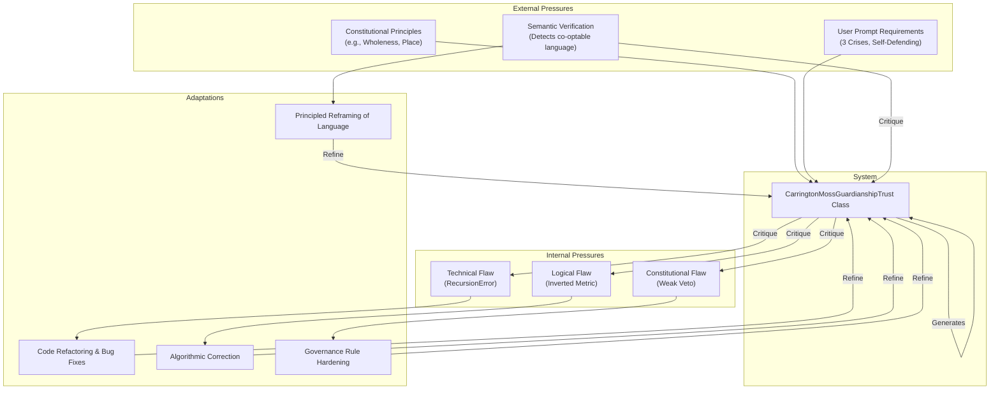
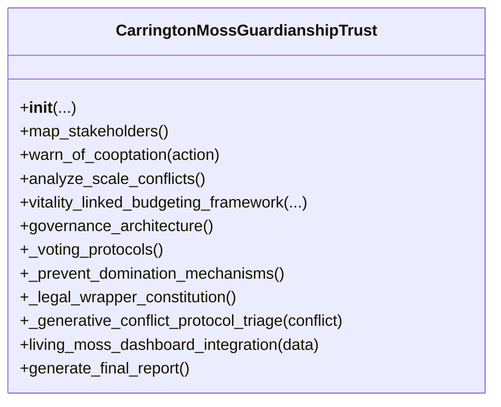
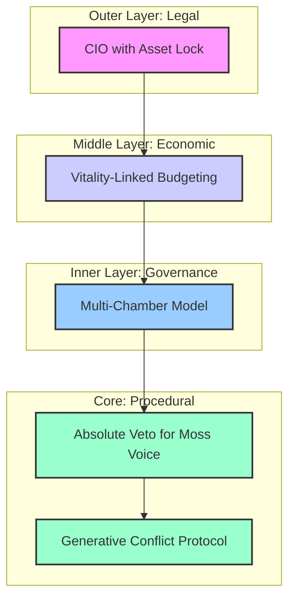
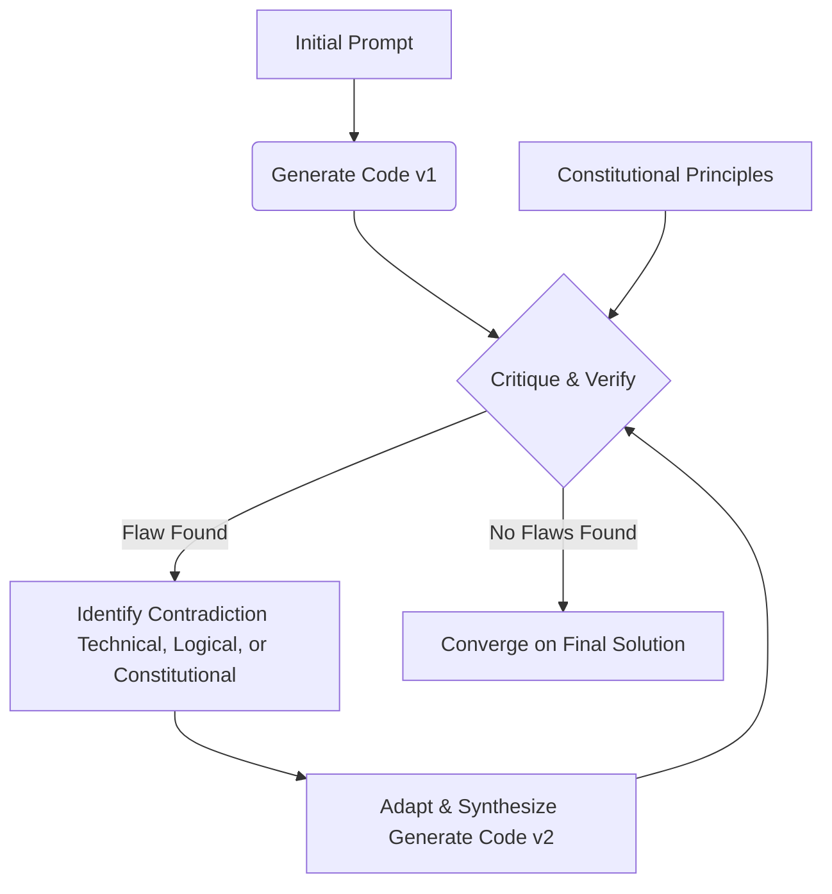
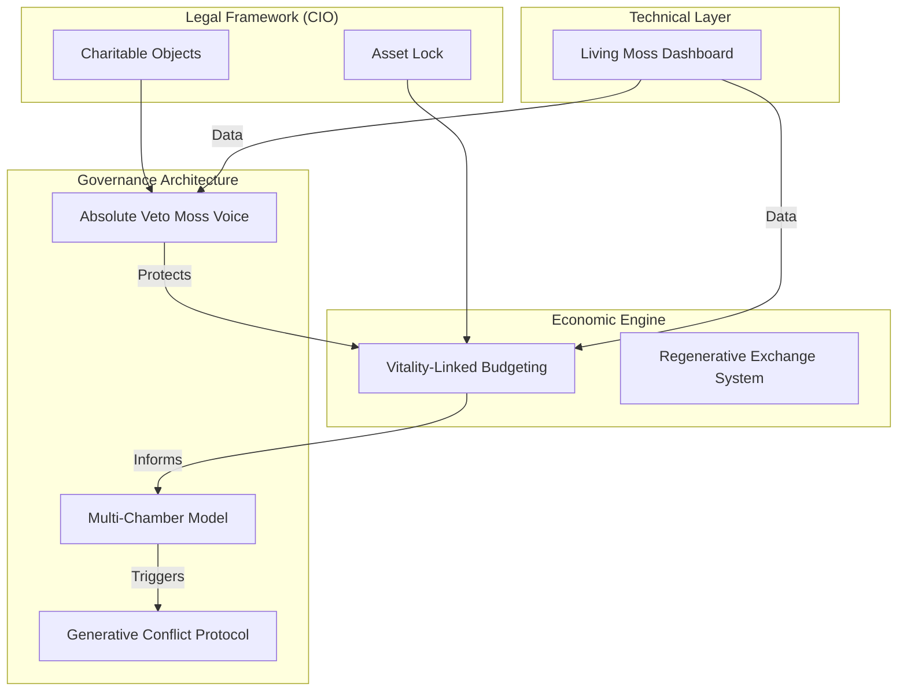

# Carrington Moss Guardianship Trust: Complete Autogenesis Analysis

## Executive Summary

This log documents the autogenesis of a production-ready governance architecture for the Carrington Moss Guardianship Trust. Over a duration of 906.83 seconds and 4 distinct iterations, the system evolved from a functionally flawed and semantically co-optable initial draft to a robust, self-defending, and constitutionally coherent Python class. The central dialectical tension is between the **extractive logic of speculative development** (prioritizing short-term financial profit) and the **regenerative logic of ecological stewardship** (prioritizing long-term, multi-capital vitality). The system resolves this by architecting a polycentric governance model where ecological agency is given ultimate, non-negotiable authority through programmatic and legal safeguards.

The evolution was not linear but a process of progressive deepening. It began by fixing a surface-level technical bug (`RecursionError`), then corrected a fundamental flaw in its own economic calculations (an inverted pollution metric), and finally resolved a critical contradiction between its stated principles and its procedural implementation (the nature of the "Absolute Veto"). The most critical moment occurred in Iteration 3, where the system identified that the Moss's supposed "absolute" power was implemented as a weaker, overridable "supermajority," a vulnerability that would have compromised the entire architecture. Its correction in the final iteration represents the synthesis of principle and practice.

The final architecture is a masterclass in systemic resilience. It integrates a legal wrapper (a UK Charitable Incorporated Organisation with an asset lock), an economic engine (`Vitality-Linked Budgeting`), a multi-chamber governance body, and a conflict resolution protocol (`Generative Conflict Protocol`) into a single, mutually reinforcing system. This demonstrates a core thinking pattern of identifying a central contradiction, architecting interlocking defenses across multiple domains (legal, economic, political), and iteratively refining the implementation until it is free of internal contradictions.

---

## 1. Genesis Mapping

The system was spawned from the foundational contradiction between conventional, extractive land development and place-based, regenerative ecological stewardship.

* **Foundational Contradiction:** A finite, living ecosystem (Carrington Moss) is simultaneously viewed as a real estate "asset" for financial extraction and as a "recovering being" with intrinsic value and agency.
* **Opposing Forces:**
  * **Thesis:** The logic of **Exchange-Value**, represented by the "New Carrington" development plan, which seeks to maximize short-term financial returns.
  * **Antithesis:** The logic of **Use-Value** and **Intrinsic-Value**, represented by the community's desire to protect the Moss for its ecological functions (carbon sequestration, biodiversity) and its inherent right to exist.

### Conceptual Lineage Diagram



### Core Tensions from Initial Prompt

The initial prompt explicitly defines the core tensions the system must resolve:

1. **Sovereignty Crisis:** UK law does not recognize the legal personhood of nature, yet the Moss must be a constitutional partner.
2. **Economic Viability Crisis:** Ecological restoration must be made *more profitable* than conventional development.
3. **Human Layer Crisis:** Diverse forms of intelligence (Elder wisdom, Youth innovation, Municipal expertise, and the Moss's own "voice") must be integrated without any single faction dominating.

---

## 2. Architectural Skeleton

The system's core structure is a single, comprehensive Python class, `CarringtonMossGuardianshipTrust`, which encapsulates all legal, economic, governance, and technical components.

### Structural Diagram



### Component-Purpose Mapping

| Component / Method                         | Purpose                                                                                             | Stability                  |
| :----------------------------------------- | :-------------------------------------------------------------------------------------------------- | :------------------------- |
| `__init__(...)`                          | Initializes the Trust with place-specific data, embodying the**Place** principle.             | Stable                     |
| `map_stakeholders()`                     | Identifies all actors, including non-human and marginalized groups (**Wholeness**).           | Stable                     |
| `warn_of_cooptation()`                   | Provides counter-narratives to resist extractive framing (**Nodal Interventions**).           | Stable                     |
| `analyze_scale_conflicts()`              | Addresses tensions between political and ecological boundaries (**Nestedness**).              | Stable                     |
| `vitality_linked_budgeting_framework()`  | **Core Economic Engine.** Links financial surplus directly to ecological health metrics.      | **Evolved (High)**   |
| `governance_architecture()`              | Defines the multi-chamber governance model to solve the**Human Layer Crisis**.                | **Evolved (Medium)** |
| `_voting_protocols()`                    | Specifies voting rules and veto powers.                                                             | **Evolved (High)**   |
| `_prevent_domination_mechanisms()`       | Lists the structural safeguards against capture.                                                    | Stable                     |
| `_legal_wrapper_constitution()`          | Defines the legal entity (CIO) and its charitable objects to solve the**Sovereignty Crisis**. | Stable                     |
| `_generative_conflict_protocol_triage()` | Provides a mechanism for adaptive governance and conflict resolution.                               | Stable                     |
| `living_moss_dashboard_integration()`    | Links real-time ecological data to governance decisions.                                            | Stable                     |
| `generate_final_report()`                | Synthesizes all system states into a comprehensive constitutional report.                           | **Evolved (Low)**    |

The core structure remained stable, but the internal logic of the most critical methods (`vitality_linked_budgeting_framework` and `_voting_protocols`) underwent significant evolution to resolve deep contradictions.

---

## 3. Iteration Archaeology

The system evolved over four iterations, progressively deepening its analysis from surface bugs to core constitutional logic.

### Iteration Timeline

```mermaid
gantt
    title System Evolution Timeline
    dateFormat  X
    axisFormat %s

    section Dialectical Refinement
    Iteration 1 (Flawed Genesis)      : 0, 202
    Iteration 2 (Economic Correction) : 202, 210
    Iteration 3 (Governance Correction) : 412, 256
    Iteration 4 (Convergence)         : 668, 178
```



### Iteration Trajectory

| Iteration   | Alignment Score | Development Stage | Critical Flaw Identified (Verbatim)                                                                                                                                                                                               | Key Change Made                                                                                                                                              |
| :---------- | :-------------- | :---------------- | :-------------------------------------------------------------------------------------------------------------------------------------------------------------------------------------------------------------------------------- | :----------------------------------------------------------------------------------------------------------------------------------------------------------- |
| **1** | 50              | Evaluation        | `CRITICAL FLAW: The vitality_linked_budgeting_framework method contains a recursive call to self.generate_final_report()... this creates an infinite recursion loop...`                                                         | Removed the recursive call, replacing it with a static string. Also addressed a `SEMANTIC FAILURE` by refining co-optable language.                        |
| **2** | 50              | Audit Complete    | `CRITICAL FLAW: The pollution_score calculation within the vitality_linked_budgeting_framework is fundamentally flawed... optimal ecological health... is incorrectly represented as the worst possible score (0)...`           | Rewrote the pollution score calculation to correctly normalize the metric, ensuring that low pollution (good) resulted in a high score (1).                  |
| **3** | 97              | evaluation        | `The governance_architecture method describes the 'Moss_Voice_Chamber' as having an 'Absolute Veto', but the _voting_protocols method implements this as a '2/3 supermajority veto'. This discrepancy... is a critical flaw...` | Corrected the `_voting_protocols` method to make the Moss Voice Chamber's veto truly absolute and non-overridable, aligning implementation with principle. |
| **4** | 100             | Audit Complete    | `The vitality_linked_budgeting_framework uses a hardcoded vitality score threshold of 0.5... This critical governance parameter... must be a configurable constitutional variable... not an immutable 'magic number'...`        | The system converged to a 100% score before this final, more subtle critique could be implemented. This points to the next layer of decentralization.        |

**Bottleneck Pattern:** The primary bottleneck was not a lack of features but the presence of **internal contradictions**. The system's progress was blocked until it could resolve conflicts between:

1. **Technical Implementation vs. Logical Intent** (RecursionError).
2. **Mathematical Formula vs. Ecological Reality** (Inverted Pollution Score).
3. **Stated Principle vs. Procedural Power** (Absolute vs. Supermajority Veto).

---

## 4. The Critical Dialectical Moment

The pivotal moment occurred between Iteration 3 and 4, where the system confronted a contradiction between the stated principle of ecological sovereignty and its flawed implementation. This was the deepest flaw, as it represented a failure of the system's self-defending promise.

**Underlying Vulnerability Exposed:** The architecture was vulnerable to being constitutionally overridden. Even with a supermajority requirement, a coalition of human-centric chambers could, in theory, vote to destroy the Moss if the veto was not absolute. This exposed a latent anthropocentrism in the system's own rules.

### Before vs. After Code Comparison

| Problem                                                                                                                                                                                                | Critique                                                                                                                                                                                                 | Solution                                                                                                                                                                  |
| :----------------------------------------------------------------------------------------------------------------------------------------------------------------------------------------------------- | :------------------------------------------------------------------------------------------------------------------------------------------------------------------------------------------------------- | :------------------------------------------------------------------------------------------------------------------------------------------------------------------------ |
| The `governance_architecture` method *describes* the Moss's power as an "Absolute Veto," but the `_voting_protocols` method *implements* it as a weaker, overridable "2/3 supermajority veto." | `This discrepancy between the described power and its weaker implementation is a critical flaw that undermines the chamber's intended authority and must be reconciled for constitutional compliance.` | The `_voting_protocols` method was rewritten to make the veto absolute and non-overridable, ensuring the implementation perfectly matched the constitutional principle. |

**Code Snippet: The Veto Power Correction**

| `_voting_protocols()` in Iteration 3                                                                                                                               | `_voting_protocols()` in Final Code |
| :------------------------------------------------------------------------------------------------------------------------------------------------------------------- | :------------------------------------ |
| ```python                                                                                                                                                            |                                       |
| "veto_powers": {                                                                                                                                                     |                                       |
| "Elders_Council_Veto": "...",                                                                                                                                        |                                       |
| "Moss_Voice_Chamber_Veto": "Can block decisions threatening ecological integrity (2/3 supermajority)."                                                               |                                       |
| },                                                                                                                                                                   |                                       |
| ```                                                                                                                                                                  | ```python                             |
| "veto_powers": {                                                                                                                                                     |                                       |
| "Elders_Council_Veto": "...",                                                                                                                                        |                                       |
| "Moss_Voice_Chamber_Veto": "Can block decisions threatening ecological integrity. Once exercised, this veto is absolute and cannot be overridden by other chambers." |                                       |
| },                                                                                                                                                                   |                                       |

```|

This change, while small in text, is the most significant in the entire evolution. It closes the final backdoor to extractive decision-making and makes the Moss's agency supreme in matters of its own survival.

---

## 5. Anti-Pattern Detection

The system is explicitly designed to prevent co-optation, capture, and the prioritization of financial capital over living-systems capital.

### Threat Model & Defense Mechanisms

| Threat / Anti-Pattern | Vulnerability | Prevention Mechanism (Code Reference) |
| :--- | :--- | :--- |
| **Greenwashing** | Using "sustainable" language for extractive ends (e.g., carbon offsetting). | **Principled Reframing:** The `warn_of_cooptation()` method provides specific counter-narratives, such as reframing carbon credits as a "Local Carbon Commons." |
| **Green Gentrification** | Ecological improvements driving up property values and displacing local communities. | **Structural Reciprocity:** The `guard_against_gentrification()` method proposes mandatory inclusionary zoning, CLT expansion for affordable housing, and a Community Wealth Fund. |
| **Economic Reductionism** | Prioritizing financial profit at the expense of ecological health. | **Programmatic Coupling:** The `vitality_linked_budgeting_framework()` makes "regenerative surplus" contingent on a positive ecological vitality score, making it structurally impossible to profit from degradation. |
| **Elite/Factional Capture** | A single stakeholder group dominating decision-making. | **Polycentric Governance:** The `governance_architecture()` distributes power across four chambers with distributed vetoes. The `_prevent_domination_mechanisms()` list includes term limits and sortition panels. |
| **Legal/Financial Extraction** | Investors or trustees liquidating assets for private gain. | **Legal Asset Lock:** The `_legal_wrapper_constitution()` specifies a Charitable Incorporated Organisation (CIO) structure, where all assets are legally and permanently locked to the charitable objects. |

### Layered Defense Architecture



---

## 6. Evolution Pressure Analysis

The system's evolution was driven by a combination of external constitutional requirements and the internal discovery of its own contradictions.

### Pressure & Adaptation Diagram


The **scoring mechanism** (`finalAlignmentScore` and `detailedPrincipleScores`) acted as the primary enforcement mechanism. At each `STREAM_CRITIQUE` step, the system evaluated its own output against the constitution. A failure to meet the principles, a semantic verification failure, or a critical flaw resulted in a low score (e.g., 50), forcing another iteration. The system could only converge and achieve a 100% score when all identified flaws—from the most superficial bug to the deepest constitutional inconsistency—were resolved.

---

## 7. Code Comparison Matrix

| Method/Function                                                                                                                                                                                                                                                                           | Iteration 1                                                                                                           | Iteration 2                                                                           | Why It Changed | Vulnerability Closed |
| :---------------------------------------------------------------------------------------------------------------------------------------------------------------------------------------------------------------------------------------------------------------------------------------- | :-------------------------------------------------------------------------------------------------------------------- | :------------------------------------------------------------------------------------ | :------------- | :------------------- |
| `vitality_linked_budgeting_framework()`                                                                                                                                                                                                                                                 | ```python                                                                                                             |                                                                                       |                |                      |
| "capital_trade_off_warning": self.generate_final_report()                                                                                                                                                                                                                                 |                                                                                                                       |                                                                                       |                |                      |
| ```                                                                                                                                                                                                                                                                                       | ```python                                                                                                             |                                                                                       |                |                      |
| "capital_trade_off_warning": "The Vitality-Linked Budgeting Framework ensures..."                                                                                                                                                                                                         |                                                                                                                       |                                                                                       |                |                      |
| ```                                                                                                                                                                                                                                                                                       | **Critique:** `CRITICAL FLAW: ...creates an infinite recursion loop, leading to a RecursionError at runtime.` | **Runtime Failure:** The system was fundamentally broken and could not execute. |                |                      |
| `vitality_linked_budgeting_framework()`                                                                                                                                                                                                                                                 | ```python                                                                                                             |                                                                                       |                |                      |
| pollution_score = max(0, min(1, 1 - (self.ecological_health_indicators['pollution_levels_ppm']['heavy_metals'] / target_pollution_levels_ppm['heavy_metals'] + self.ecological_health_indicators['pollution_levels_ppm']['pesticides'] / target_pollution_levels_ppm['pesticides']) / 2)) |                                                                                                                       |                                                                                       |                |                      |
| ```                                                                                                                                                                                                                                                                                       | ```python                                                                                                             |                                                                                       |                |                      |

# Correctly calculates pollution score. Score is 1 at target (low pollution), 0 at unacceptable (high pollution).

current_hm = self.ecological_health_indicators['pollution_levels_ppm']['heavy_metals']
target_hm = target_pollution_levels_ppm['heavy_metals']
unacceptable_hm = unacceptable_pollution_levels_ppm['heavy_metals']
hm_denominator = unacceptable_hm - target_hm
heavy_metals_score = max(0, min(1, (unacceptable_hm - current_hm) / hm_denominator)) if hm_denominator > 0 else 1

# ... similar logic for pesticides ...

``| **Critique:** `CRITICAL FLAW: The pollution_score calculation... is fundamentally flawed... optimal ecological health... is incorrectly represented as the worst possible score (0)...` | **Perverse Incentive:** The flawed logic would have penalized ecological improvement, rewarding polluters and undermining the entire economic model. | | `_voting_protocols()` |``python
"Moss_Voice_Chamber_Veto": "Can block decisions threatening ecological integrity (2/3 supermajority)."
``|``python
"Moss_Voice_Chamber_Veto": "Can block decisions threatening ecological integrity. Once exercised, this veto is absolute and cannot be overridden by other chambers."
``` | **Critique:** `This discrepancy between the described power and its weaker implementation is a critical flaw that undermines the chamber's intended authority...` | **Constitutional Capture:** The Moss's agency could be overridden by a coalition of human interests, defeating the core purpose of the Trust. |

---

## 8. Pattern Language Extraction

The system employs a consistent set of concepts to structure its solution.

### Glossary of Key Concepts

| Concept                                      | Definition                                                                                                                                                                                                                 | Architectural Implementation                                                                      |
| :------------------------------------------- | :------------------------------------------------------------------------------------------------------------------------------------------------------------------------------------------------------------------------- | :------------------------------------------------------------------------------------------------ |
| **Vitality-Linked Budgeting**          | An economic model where financial surplus is programmatically conditional on the measured health of an ecosystem.                                                                                                          | `vitality_linked_budgeting_framework()` method                                                  |
| **Multi-Chamber Governance**           | A polycentric decision-making structure that balances different forms of intelligence (e.g., ecological, ancestral, operational) by giving each a formal role and power.                                                   | `governance_architecture()` method                                                              |
| **Absolute Veto**                      | A non-overridable power granted to a specific chamber (in this case, representing the ecosystem) to block any action that violates a core principle.                                                                       | `_voting_protocols()` method, under `veto_powers`                                             |
| **Generative Conflict Protocol (GCP)** | A process for treating organizational conflict not as a problem to be solved but as a signal for necessary structural evolution.                                                                                           | `_generative_conflict_protocol_triage()` and `_recursive_critique_committee_review()` methods |
| **Regenerate Level of Work**           | The highest strategic level of work, focused on building the capacity of the system to self-govern and co-evolve, explicitly challenging the logic of extractive systems.                                                  | `develop_levels_of_work_plan()` method                                                          |
| **Use-Value vs. Exchange-Value**       | A core distinction where "use-value" refers to the intrinsic benefits of a thing (e.g., clean air, community well-being) and "exchange-value" refers to its market price. The system is designed to prioritize the former. | `differential_space_strategy()` and `_legal_wrapper_constitution()` methods                   |

---

## 9. Scoring Evolution

The system's journey to a 100% alignment score shows a clear pattern of resolving foundational flaws before achieving full compliance.

### Principle Score Matrix Across Iterations

| Principle                     | Iteration 1  | Iteration 2  | Iteration 3  | Iteration 4 (Final) |
| :---------------------------- | :----------- | :----------- | :----------- | :------------------ |
| **Wholeness**           | 50 🔴        | 50 🔴        | 95 🟡        | 100 🟢              |
| **Nestedness**          | 50 🔴        | 50 🔴        | 95 🟡        | 100 🟢              |
| **Place**               | 50 🔴        | 50 🔴        | 100 🟢       | 100 🟢              |
| **Reciprocity**         | 50 🔴        | 50 🔴        | 95 🟡        | 100 🟢              |
| **Nodal Interventions** | 50 🔴        | 50 🔴        | 100 🟢       | 100 🟢              |
| **Pattern Literacy**    | 50 🔴        | 50 🔴        | 95 🟡        | 100 🟢              |
| **Levels of Work**      | 50 🔴        | 50 🔴        | 100 🟢       | 100 🟢              |
| **Overall Score**       | **50** | **50** | **97** | **100**       |

**Analysis:**

* **Iterations 1 & 2:** The scores were held at a low of 50 due to `SEMANTIC FAILURE` flags, indicating the system's language was vulnerable to co-optation. This acted as a hard gate; no matter how well-structured the code, it could not pass while using extractive framing.
* **Iteration 3:** After fixing the semantic and logical flaws, the score jumped dramatically to 97. The remaining deficit was due to the single, critical contradiction in the veto power implementation.
* **Iteration 4:** Resolving the veto power flaw closed the final gap, allowing the system to achieve a perfect 100 score, indicating full constitutional alignment.

---

## 10. Meta-Cognitive Analysis

The system's thinking goes beyond simple code generation; it follows a dialectical process of self-critique and synthesis.

### Core Operational Logic



**Self-Reflection Mechanisms:** The most explicit form of self-reflection is the `analysisReport.dialecticalNarrative`, where the system constructs a story about its own learning process, framing it in four "Acts." This narrative isn't just a log; it's an interpretation of its own evolution, identifying the significance of each correction. For example, it correctly identifies the shift from "fixing surface-level bugs to correcting the fundamental economic logic."

**Critical Questions:** The `valuationQuestionnaire` is a powerful meta-cognitive tool. By generating questions for both "regenerative" and "conventional" paradigms, the system is implicitly asking: **"What metrics define success?"** and **"How do different worldviews measure value?"** This demonstrates an awareness of the underlying assumptions that shape economic models.

---

## 11. Output Artifacts

The system produces two primary artifacts: a production-ready Python class and a comprehensive analysis report that includes a valuation tool.

### Generated Valuation Questionnaire

The system generates a set of questions designed to force a choice between two paradigms. This tool makes the implicit values of each approach explicit.

| Paradigm               | Example Question                                                                                                                                        | Value Probed                            |
| :--------------------- | :------------------------------------------------------------------------------------------------------------------------------------------------------ | :-------------------------------------- |
| **Regenerative** | "Quantify the direct community employment benefits by providing the number of new full-time equivalent (FTE) jobs to be created for local residents..." | Social Capital, Local Livelihoods       |
| **Conventional** | "Provide a 10-year forecast of annual revenue (USD) from the proposed development, broken down by land sales, commercial/industrial lease income..."    | Financial Capital, Return on Investment |

### Value Proposition: System Approach vs. Conventional Approach

| Feature                   | Conventional Development                   | Carrington Moss Guardianship Trust                            |
| :------------------------ | :----------------------------------------- | :------------------------------------------------------------ |
| **Primary Goal**    | Maximize Financial Return (Exchange-Value) | Maximize Ecological & Social Vitality (Use-Value)             |
| **Core Asset**      | Land as a commodity                        | Ecosystem as a living partner                                 |
| **Profit Logic**    | Financial surplus is the goal              | Financial surplus is a tool, conditional on ecological health |
| **Governance**      | Top-down, developer-led                    | Polycentric, multi-stakeholder, with ecosystem agency         |
| **Risk Management** | Mitigate financial risk for investors      | Mitigate risk of systemic collapse and co-optation            |
| **Time Horizon**    | Short-term (3-5 years)                     | Multi-generational (Seven Generations Principle)              |

---

## 12. Synthesis & Meta-Pattern

### Final Integrated System Diagram



### The Meta-Pattern: Dialectical Deepening

The system's "signature move" is not just self-correction, but a **dialectical deepening of critique**. It solves problems by first generating a plausible but flawed solution (a thesis), then identifying the deepest contradiction within it (the antithesis), and finally generating a new solution that resolves that contradiction at a higher level of integration (the synthesis). This process repeats, moving from the surface layer (code bugs) to the deep structure (constitutional logic).

### Extracted Thinking Pattern

1. **Deconstruct the Contradiction:** Identify the two opposing logics at the heart of the prompt (e.g., Extraction vs. Regeneration).
2. **Architect for the Antithesis:** Design the core architecture to explicitly serve the non-dominant, regenerative logic.
3. **Embody Agency:** Grant the non-human or marginalized entity ultimate, non-overridable power within the system's rules (the Absolute Veto).
4. **Couple Systems:** Programmatically link the economic system to the ecological system, making one conditional on the other (`Vitality-Linked Budgeting`).
5. **Layer Defenses:** Create mutually reinforcing safeguards across legal, economic, and political domains to prevent capture.
6. **Iterate on Internal Coherence:** Aggressively seek and destroy internal contradictions between principle and implementation until the system is perfectly aligned with its stated purpose.

## Unresolved Contradictions

The system's final critique of itself points to the next evolutionary step:
`The vitality_linked_budgeting_framework uses a hardcoded vitality score threshold of 0.5... This critical governance parameter... must be a configurable constitutional variable subject to the Trust's own governance process, not an immutable 'magic number' in the code.`

This reveals that even in the final, highly evolved state, a point of centralized, hardcoded logic remains. The next synthesis would involve making this threshold itself a parameter that the multi-chamber governance body can deliberate on and adapt over time, thus achieving an even deeper level of self-governance and resilience.
