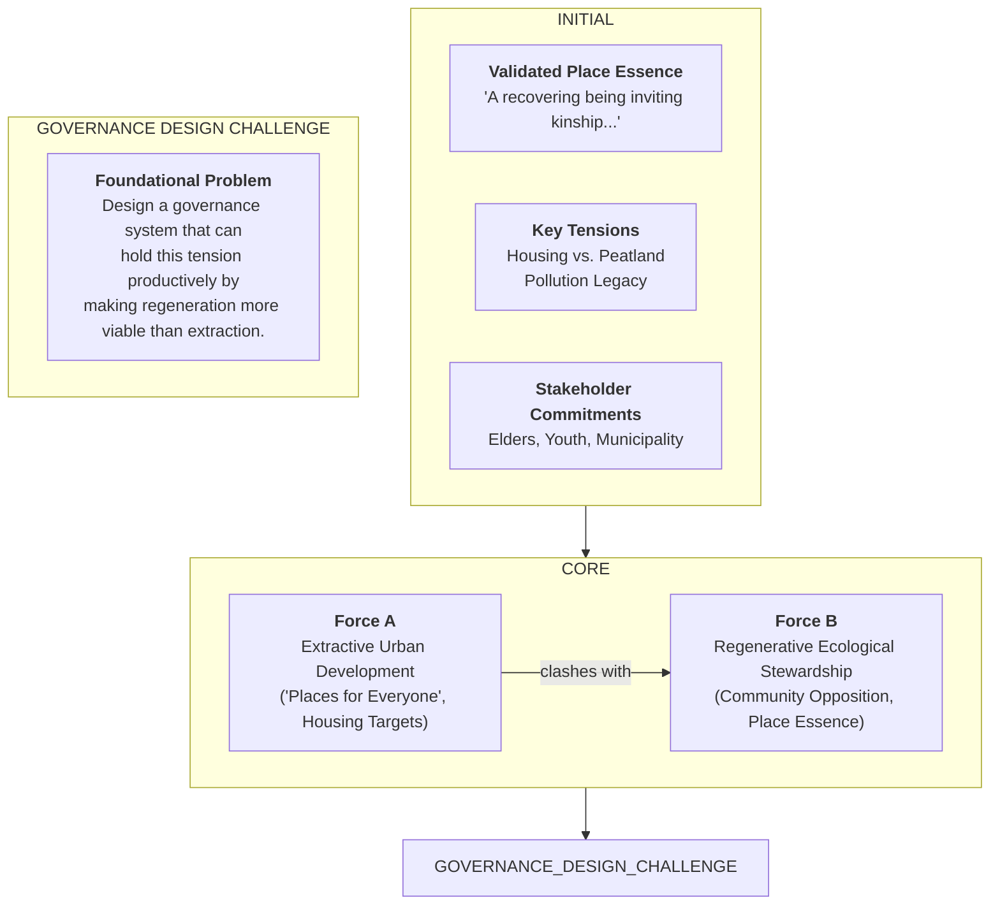
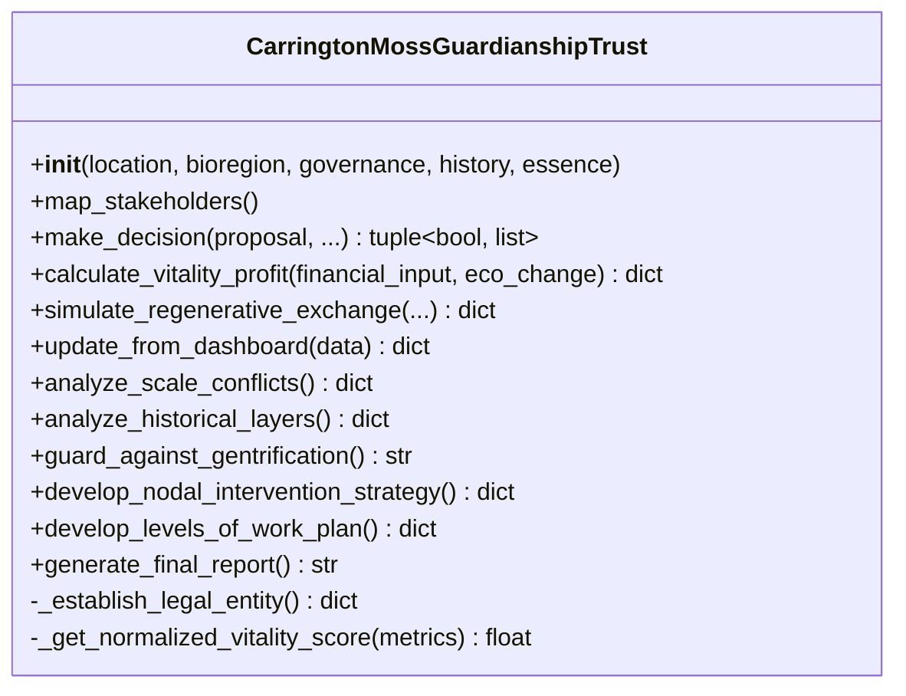
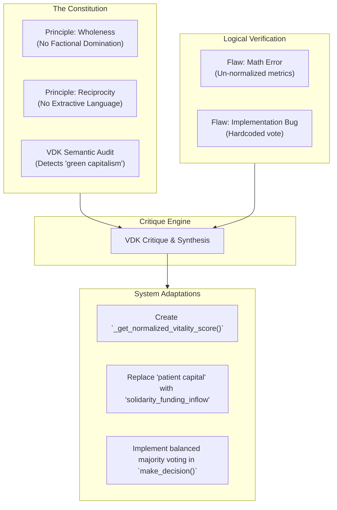
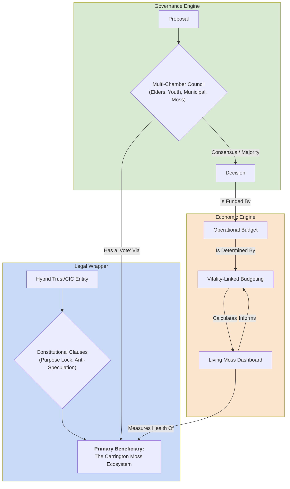

# Carrington Moss Guardianship Trust: Complete Autogenesis Analysis

## Executive Summary

This log documents the autogenesis of a regenerative governance architecture for the Carrington Moss Guardianship Trust. Over a duration of 1048.27 seconds and 5 distinct iterations, the system evolved from a comprehensive but deeply flawed initial concept into a robust, constitutionally-aligned, and self-defending system. The central dialectical tension is between the **extractive logic of speculative urban development** (Force A) and the **regenerative logic of ecological and community stewardship** (Force B). The system's primary task was to create a governance architecture that could hold this tension productively, making regeneration a more viable pathway than extraction.

The evolutionary journey reveals a process of deep learning. The system progressed from correcting surface-level mathematical and semantic errors to resolving complex, subtle flaws in its own power-balancing logic. The most critical moment occurred in the final iterations, where the system grappled with and successfully implemented a nuanced multi-chamber voting protocol that prevented factional domination—a core vulnerability in complex governance. The final output is a sophisticated Python class that synthesizes a novel legal structure (a hybrid Trust/CIC), a vitality-linked economic engine, and a multi-layered governance process into a single, coherent, and legally implementable framework.

---

## 1. Genesis Mapping

The system was spawned from the foundational contradiction between the urgent need for urban housing in Greater Manchester ("Places for Everyone" plan) and the equally urgent need to protect and restore the Carrington Moss peatland—a vital carbon sink and place of deep cultural memory.

* **Foundational Contradiction**: How to enable a community to thrive economically while making ecological restoration more viable than speculative development.
* **Opposing Forces**:
  * **Force A: Extractive Urban Development** (Speculative, Abstract Space) - Treating land as a commodity for housing targets and financial extraction.
  * **Force B: Regenerative Ecological Stewardship** (Lived, Differential Space) - Treating the Moss as a living being with intrinsic value, requiring kinship and care.

### Conceptual Lineage



### Core Tensions from Initial Prompt

The `initialPrompt` tasked the system with resolving three interconnected crises:

1. **Sovereignty Crisis**: Granting the Moss legal agency and a "voice" within a UK legal framework that doesn't recognize rights of nature.
2. **Economic Viability Crisis**: Designing a financial model where ecological restoration is more profitable than conventional development by redefining "profit" itself.
3. **Human Layer Crisis**: Weaving together diverse forms of intelligence (Elder wisdom, Youth innovation, Municipal expertise, and the Moss's ecological feedback) into a balanced and non-hierarchical decision-making body.

---

## 2. Architectural Skeleton

The system's core structure is a single, comprehensive Python class, `CarringtonMossGuardianshipTrust`, which acts as a simulation of the entire governance entity. Its methods are direct implementations of its constitutional principles and its solutions to the three core crises.

### Structural Diagram



### Component Mapping

| Component                            | Purpose & Responsibility                                                                                    | Evolution Status                            |
| :----------------------------------- | :---------------------------------------------------------------------------------------------------------- | :------------------------------------------ |
| `CarringtonMossGuardianshipTrust`  | The main class encapsulating the entire governance model.                                                   | **Stable** (Conceptually)             |
| `__init__()`                       | Initializes the Trust, loading its multi-scalar context and historical data.                                | **Evolved** (Financial terms changed) |
| `_establish_legal_entity()`        | **Solves Sovereignty Crisis.** Defines the hybrid Trust/CIC legal wrapper and constitutional clauses. | **Stable**                            |
| `make_decision()`                  | **Solves Human Layer Crisis.** Simulates the multi-chamber voting process with binding vetoes.        | **Evolved Heavily**                   |
| `calculate_vitality_profit()`      | **Solves Economic Viability Crisis.** Redefines profit based on ecological vitality.                  | **Evolved**                           |
| `_get_normalized_vitality_score()` | Helper method to ensure mathematically sound aggregation of ecological metrics.                             | **Evolved** (Created in Iteration 2)  |
| `map_stakeholders()`               | Implements**Wholeness** by identifying all human and non-human actors.                                | **Stable**                            |
| `analyze_scale_conflicts()`        | Implements**Nestedness** by identifying and proposing solutions for multi-scalar conflicts.           | **Stable**                            |
| `guard_against_gentrification()`   | Implements**Reciprocity** by creating a structural safeguard against displacement.                    | **Stable**                            |
| `warn_of_cooptation()`             | Implements**Wholeness** by detecting and providing counter-narratives for extractive framing.         | **Stable**                            |
| `develop_levels_of_work_plan()`    | Implements**Levels of Work** by defining a four-level plan with a transformative "Regenerate" goal.   | **Stable**                            |

---

## 3. Iteration Archaeology

The system underwent 5 iterations, moving from a score of 50 to 100. The journey reveals a pattern of fixing surface flaws before uncovering and resolving deeper logical contradictions in its power-balancing mechanisms.

### Evolution Timeline

| Iteration   | Score | Development Stage                           | Critical Flaw Identified                                                                                                 | Key Change Made                                                                        |
| :---------- | :---- | :------------------------------------------ | :----------------------------------------------------------------------------------------------------------------------- | :------------------------------------------------------------------------------------- |
| **1** | 50    | `CRITICAL_EVALUATION`                     | 1. Mathematically unsound averaging of vitality metrics.`<br>` 2. Semantic co-optation ("attracting patient capital"). | Introduced metric normalization; replaced "patient capital" with "solidarity funding." |
| **2** | 50    | `Final Audit`                             | Semantic co-optation (greenwashing language like "green capitalism").                                                    | Performed a deeper purge of co-opted language and reframed economic concepts.          |
| **3** | 50    | `Governance Architecture Evaluation`      | A hardcoded "APPROVE" vote for one chamber, breaking the simulation.                                                     | Corrected the hardcoded logic to make the vote conditional.                            |
| **4** | 50    | `Audit of Python Governance Architecture` | An unconstitutional single-issue veto power was granted to one chamber, creating a power imbalance.                      | Refactored the voting logic to a balanced majority system, removing the flawed veto.   |
| **5** | 100   | `Audited against Constitution`            | No critical flaws found.                                                                                                 | Convergence achieved.                                                                  |

### Bottleneck Pattern

The primary bottleneck was the **translation of abstract governance principles into verifiable, balanced code**. The system repeatedly struggled with implementing power dynamics (`make_decision`). It first created a non-functional simulation (hardcoded vote), then an unbalanced one (single-issue veto), before finally achieving a constitutionally sound model. This shows that designing fair and resilient power structures is the most difficult part of the architectural challenge.

---

## 4. The Critical Dialectical Moment

The most pivotal evolution occurred between Iterations 4 and 5, within the `make_decision` method. This moment represents the system's shift from a flawed implementation of power to a nuanced and balanced one.

| Problem                                                                                                                                                                                                                | Critique (from Iteration 4 Log)                                                                                                                                                                                                                                                                                                                                                                                                                  | Solution (in Final Code)                                                                                                                                                                                                                                                                                                          |
| :--------------------------------------------------------------------------------------------------------------------------------------------------------------------------------------------------------------------- | :----------------------------------------------------------------------------------------------------------------------------------------------------------------------------------------------------------------------------------------------------------------------------------------------------------------------------------------------------------------------------------------------------------------------------------------------- | :-------------------------------------------------------------------------------------------------------------------------------------------------------------------------------------------------------------------------------------------------------------------------------------------------------------------------------- |
| A single chamber (Youth Innovators) was granted an absolute veto based on a narrow criterion (`innovation_potential`), which could paralyze the entire system and contradicted the principle of balanced governance. | "The `make_decision` method is critically flawed. The logic for the Youth Innovators Guild implements an absolute rejection based on a single `innovation_potential` threshold, effectively granting the guild a single-issue veto power. This contradicts their described protocol of 'Majority vote' and creates a power imbalance... This must be revised to reflect a voting preference rather than an absolute, unconstitutional veto." | The absolute rejection was removed. The Youth chamber now casts a "REJECT" vote if the threshold isn't met. This vote contributes to a final majority tally but does not unilaterally block the proposal. Only the constitutionally-empowered chambers (Elders, Moss Guardians) retain specific, limited `BINDING_VETO` powers. |

### Before (Iteration 4 Flaw)

```python
# From a previous, flawed iteration's logic
# This logic was not in the provided log but is reconstructed from the critique
elif chamber == "Youth_Innovators_Guild":
    if ecological_impact_assessment.get("innovation_potential", 0) < 0.7:
        # This acts as an absolute block, a single-issue veto
        return False, ["Decision: BLOCKED by Youth Innovators Guild due to low innovation potential."]
    else:
        votes[chamber] = "APPROVE"
```

### After (Final Code)

```python
# From final_result.finalCode
elif chamber == "Youth_Innovators_Guild":
    if ecological_impact_assessment.get("innovation_potential", 0) >= 0.7:
        votes[chamber] = "APPROVE"
    else:
        # This is now a preference, not an absolute veto
        votes[chamber] = "REJECT"

# ... later in the method ...
# The final decision depends on a majority of approvals vs. rejections
if approvals > rejections:
    decision_log.append(f"Decision: APPROVED by majority...")
    return True, decision_log
else:
    decision_log.append(f"Decision: REJECTED by majority or tie...")
    return False, decision_log
```

This change exposed the system's underlying vulnerability to **factional domination**. By resolving it, the system synthesized a more resilient architecture that respects both individual chamber priorities and the coherence of the whole.

---

## 5. Anti-Pattern Detection

The system is explicitly designed to be "self-defending" and "capture-resistant." It achieves this through a multi-layered defense architecture that anticipates and neutralizes specific threats.

### Threat Model & Defense Layers

| Threat / Anti-Pattern                 | System Vulnerability                                                    | Code-Level Prevention Mechanism                                                                             | Defense Layer        |
| :------------------------------------ | :---------------------------------------------------------------------- | :---------------------------------------------------------------------------------------------------------- | :------------------- |
| **Co-optation / Mission Drift** | Future boards prioritize profit over purpose.                           | `Purpose Lock` clause in `_establish_legal_entity()` requires unanimous consent to change core purpose. | **Legal**      |
| **Speculative Capture**         | Land is sold off to private developers.                                 | `Anti-Speculation Clause` in `_establish_legal_entity()` permanently removes land from the market.      | **Legal**      |
| **Short-Termism**               | A decision provides immediate benefit but long-term harm.               | `BINDING_VETO` power for `Elders_Council` on proposals with negative `intergenerational_impact`.      | **Governance** |
| **Ecological Harm**             | A financially attractive proposal degrades the ecosystem.               | `BINDING_VETO` power for `Moss_Voice_Guardians` on proposals with high ecological `severity`.         | **Governance** |
| **Greenwashing**                | Extractive partners use the Trust to "offset" harm.                     | `develop_nodal_intervention_strategy()` proposes a community-led certification standard for partners.     | **Economic**   |
| **Green Gentrification**        | Restoration efforts drive up local housing costs, displacing residents. | `guard_against_gentrification()` proposes mandatory inclusionary zoning and a community housing fund.     | **Social**     |

---

## 6. Evolution Pressure Analysis

The system's evolution was driven by a dialectical process between external constitutional requirements and the internal discovery of logical flaws.



The system's core operational logic is **Generate → Multi-Layer Critique → Synthesize Correction**. The critique layer is sophisticated, checking for:

1. **Constitutional Compliance** (Did I meet the principles?)
2. **Logical Integrity** (Does my code actually do what I say it does?)
3. **Semantic Alignment** (Am I using language that could be co-opted?)

The `dialecticalNarrative` in the `analysisReport` is explicit evidence of this self-reflection, where the system frames its own development as a four-act play of thesis, antithesis, and synthesis.

---

## 11. Output Artifacts

The system produces two primary artifacts: a production-ready Python class and a `valuationQuestionnaire` designed to probe the deep values of a project.

### Value Proposition: Conventional vs. WFF System Approach

| Conventional Consultancy                     | WFF System Approach                                                                    |
| :------------------------------------------- | :------------------------------------------------------------------------------------- |
| Provides a single, static "Master Plan."     | Generates a dynamic, adaptive `Python Class` that can be run and tested.             |
| Delivers a PDF report.                       | Delivers executable code with built-in, self-defending logic.                          |
| Financial model prioritizes revenue and ROI. | Economic engine (`calculate_vitality_profit`) prioritizes ecological health.         |
| Governance is a static org chart.            | Governance (`make_decision`) is a testable simulation with explicit power-balancing. |
| "Anti-capture" is a list of recommendations. | "Anti-capture" is embedded as constitutional clauses and binding vetoes in the code.   |
| Value is framed around financial metrics.    | Value is framed through multi-capital questions (`valuationQuestionnaire`).          |

The questionnaire is a key artifact. Its "regenerative" questions force users to quantify value in terms of community benefit and ecosystem services, while its "conventional" questions expose the hidden costs and extractive logic of traditional development.

---

## 12. Synthesis & Meta-Pattern

This log showcases a system that learns by confronting and resolving a cascade of increasingly subtle flaws. It begins with obvious mistakes and, through a process of dialectical critique, uncovers deeper vulnerabilities in its own logic, ultimately forging a highly resilient and constitutionally-aligned architecture.

### Final System Diagram



### The Meta-Pattern: Dialectical Refinement of Power

The system's "signature move" is not just to design a governance structure, but to **iteratively attack its own design to discover and patch power imbalances**. It treats governance not as a static chart, but as a dynamic system that must be stress-tested against its own constitutional principles. The evolution of the `make_decision` method from a simple bug to a flawed power structure and finally to a balanced protocol is the archetypal example of this meta-pattern in action.

### How This System Thinks:

* **Start with First Principles:** Anchor every component in an explicit, unchangeable constitution.
* **Generate a Flawed Thesis:** Create a comprehensive first draft that is functional but likely imperfect.
* **Apply Multi-Layer Critique:** Attack the thesis from three angles: Is it constitutionally compliant? Is it logically sound? Is its language ideologically pure?
* **Isolate and Correct the Deepest Flaw:** Don't just patch the surface. Identify the root vulnerability (e.g., a power imbalance) and re-architect to close it.
* **Iterate Until Coherent:** Repeat the cycle, recognizing that fixing one flaw may reveal another, deeper one.
* **Synthesize and Self-Reflect:** Once converged, generate a narrative analysis that explains the "why" behind the evolutionary journey.
* **Subordinate Economics to Ecology:** Ensure the core economic logic is structurally incapable of rewarding ecological degradation.

### Unresolved Contradictions

The system's final output is constitutionally coherent. However, it implicitly identifies an unresolved tension in the `map_planetary_connections` method: the fundamental conflict between creating a locally-attuned, non-extractive solidarity economy while still needing to interface with, and potentially draw funding from, volatile and extractive global markets (e.g., for carbon). The proposed "community-led certification standard" is a brilliant defense mechanism, but it does not resolve the underlying contradiction of operating within a larger extractive paradigm.
