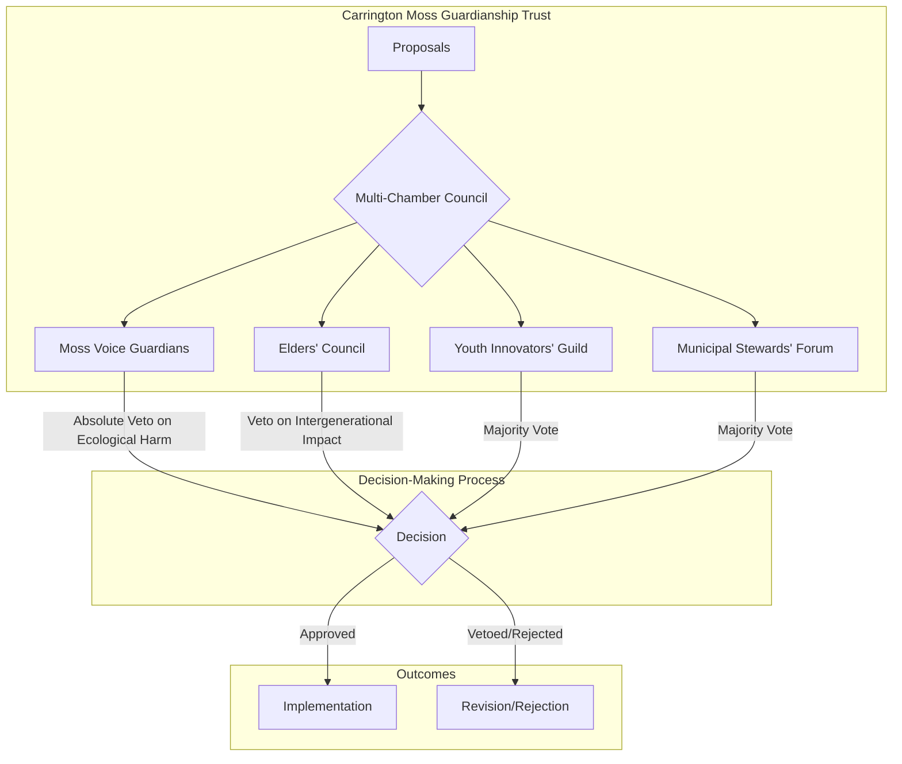

# **Executive Summary**

This report provides a comprehensive analysis of five distinct AI-generated governance architectures for the proposed Carrington Moss Guardianship Trust. Each model, developed through a dialectical process of generation and critique, offers a unique yet robust framework for regenerative, self-defending governance. While all solutions successfully operationalize the core principles of the Wisdom Forcing Function (WFF) constitution, they exhibit significant variations in their legal structures, economic models, and anti-capture mechanisms.

Two primary "families" of governance architecture emerge from this analysis:

* **Hybrid Charitable Models:** These architectures prioritize a strong legal and fiduciary duty to the ecosystem by leveraging established non-profit structures like Charitable Incorporated Organisations (CIOs) and Community Land Trusts (CLTs). They focus on decommodifying the land and embedding the "rights of nature" within their charitable objectives.
* **Hybrid Social Enterprise Models:** These models blend non-profit and for-profit elements, typically combining a Charitable Trust with a Community Interest Company (CIC). This approach provides greater flexibility for engaging in regenerative economic activities while maintaining a legal "asset lock" to prevent private wealth extraction.

All models converge on a multi-chamber governance structure to ensure diverse representation and prevent domination by any single interest group. A key innovation across all solutions is the "Vitality-Linked Budgeting" system, which redefines profit in terms of ecological health, thereby structurally aligning economic activity with environmental regeneration. Furthermore, each architecture incorporates sophisticated anti-capture mechanisms, such as absolute veto powers for ecological guardians and community-led certification standards to mitigate greenwashing.

This comparative analysis reveals a spectrum of highly resilient and innovative governance solutions, each with distinct strengths. The findings demonstrate the AI's capacity to generate nuanced, context-specific, and legally grounded architectures for complex, real-world challenges in regenerative development.

### **1. Comparative Analysis of Governance Architectures**

The five analyzed reports present a range of sophisticated governance models for the Carrington Moss Guardianship Trust. While all share a common goal of creating a self-defending, regenerative system, they employ different strategies to achieve this. The following table provides a high-level comparison of the core architectural components across the five runs.

| **Session ID**                    | **Primary Legal Structure**                                               | **Economic Model Innovation**                              | **Key Anti-Capture Mechanisms**                                                                               | **Noteworthy Innovations**                                                                                |
| :-------------------------------------- | :------------------------------------------------------------------------------ | :--------------------------------------------------------------- | :------------------------------------------------------------------------------------------------------------------ | :-------------------------------------------------------------------------------------------------------------- |
| **session-1761131961112-0uw8fih** | Hybrid: Charitable Incorporated Organisation (CIO) + Community Land Trust (CLT) | Vitality-Linked Budgeting                                        | Constitutional Vitality Veto (non-discretionary, data-driven), Multi-Chamber Governance, Moss Kinship Certification | "Constitutional Vitality Veto" as an automatic safeguard, "Moss Kinship Certification" to counter greenwashing. |
| **session-1760965823768-ohek1o8** | Charitable Incorporated Organisation (CIO)                                      | Vitality-Linked Budgeting                                        | Data-Driven Veto Power, Structural Decommodification (CLT), Nodal Defense Standard ("Moss-Certified")               | Designating the Moss as the primary beneficiary of the CIO.                                                     |
| **session-1761115779580-ev1wec4** | Hybrid: Community Interest Company (CIC) + Charitable Trust                     | Vitality-Linked Budgeting ("Total Ecological Vitality Gain")     | Multi-Chamber Governance with Veto Power, Supermajority Voting, Community-Led Regenerative Certification            | Explicit redefinition of "profit" as "Total Ecological Vitality Gain".                                          |
| **session-1761128921131-ad7xygk** | Charitable Incorporated Organisation (CIO)                                      | Vitality-Linked Budgeting ("Regenerative Surplus")               | Absolute Veto for "Moss Voice Chamber", Generative Conflict Protocol (GCP), CIO with Asset Lock                     | "Generative Conflict Protocol" for escalating and resolving disputes.                                           |
| **session-1761130376475-6jqh230** | Hybrid: Community Benefit Organisation (Charitable Trust + CIC)                 | Vitality-Linked Budgeting (Normalized ecological vitality score) | Binding Veto Powers (Moss & Elders), Constitutional "Purpose Lock", Community-Led Certification Standard            | A novel hybrid legal entity and a mathematically robust vitality-linked profit model.                           |

### **2. Families of Governance Architectures**

Based on the analysis, two distinct families of governance models emerge, primarily differentiated by their legal and economic structures.

#### **2.1 Family A: Hybrid Charitable Models**

This family, encompassing sessions `1761131961112-0uw8fih`, `1760965823768-ohek1o8`, and `1761128921131-ad7xygk`, centers on established non-profit legal structures to create a strong fiduciary duty to the ecosystem.

* **Core Principle:** Prioritizing the legal protection and decommodification of the land and ecosystem.
* **Common Structures:**
  * **Charitable Incorporated Organisation (CIO):** Provides a robust legal entity that can hold land and enter into contracts, with its charitable objectives legally binding it to act in the Moss's interest.
  * **Community Land Trust (CLT):** A mechanism to separate the ownership of land from the buildings on it, ensuring the land remains a community asset in perpetuity and preventing speculative development.
* **Strengths:** High degree of legal resilience against financialization and speculative pressures due to the inherent asset locks in charitable and CLT structures.

#### **2.2 Family B: Hybrid Social Enterprise Models**

This family, represented by sessions `1761115779580-ev1wec4` and `1761130376475-6jqh230`, combines non-profit and social enterprise elements to create a more flexible economic model.

* **Core Principle:** Balancing strong legal protection with the flexibility to engage in regenerative economic activities.
* **Common Structures:**
  * **Community Interest Company (CIC):** A type of company designed for social enterprises that want to use their profits and assets for the public good. It includes a statutory "asset lock" to prevent the distribution of profits to shareholders.
  * **Charitable Trust Overlay:** This is often combined with a CIC to provide an additional layer of legal protection and ensure that the organization's primary purpose remains charitable.
* **Strengths:** Greater operational flexibility to generate revenue through regenerative enterprises, potentially leading to greater financial self-sufficiency.

### **3. Governance Structure and Decision-Making**

A significant point of convergence across all models is the adoption of a multi-chamber governance structure. This design choice directly addresses the "Human Layer Crisis" by integrating diverse forms of intelligence and preventing any single faction from dominating.

#### **Mermaid Diagram of a Typical Multi-Chamber Governance Model**

**Key Features of the Multi-Chamber Governance:**

* **Diverse Representation:** All models include chambers for Elders (long-term wisdom), Youth (innovation), the Municipality (procedural knowledge), and the Moss itself (ecological integrity).
* **Distributed Power:** No single chamber holds absolute power. Decision-making relies on a system of checks and balances, including majority voting, supermajority requirements for significant changes, and targeted veto powers.
* **Absolute Ecological Veto:** A crucial innovation in all models is the granting of an absolute and non-overridable veto to the "Moss Voice Guardians" on any proposal that would harm the ecosystem's health. This embeds the "rights of nature" directly into the governance process.

### **4. Economic Model: Vitality-Linked Budgeting**

The most significant economic innovation present in all five reports is the "Vitality-Linked Budgeting" system. This model fundamentally reorients the organization's financial incentives towards ecological regeneration.

* **Core Concept:** "Profit" is redefined not as financial surplus, but as a measurable improvement in the ecological health of Carrington Moss.
* **Mechanism:**
  1. A "Living Moss Dashboard" provides real-time data on key ecological indicators (e.g., water table levels, carbon sequestration rates, biodiversity indices).
  2. These indicators are aggregated into a normalized "Ecological Vitality Score."
  3. The Trust's ability to declare a "regenerative surplus" and allocate funds for non-essential activities is directly tied to this score. It becomes structurally impossible to be "profitable" while degrading the ecosystem.
* **Positive Aspects:**
  * **Aligns Incentives:** Creates a direct financial incentive for all stakeholders to prioritize ecological restoration.
  * **Prevents Greenwashing:** Makes it impossible to claim financial success while externalizing environmental costs.
  * **Data-Driven:** Grounds decision-making in objective, measurable ecological data.

### **5. Anti-Capture Mechanisms**

Recognizing the threat of co-optation by extractive interests, each AI-generated architecture includes a suite of "self-defending" mechanisms.

| **Mechanism**                    | **Description**                                                                                                                                                                           | **Present In Sessions**                                       |
| :------------------------------------- | :---------------------------------------------------------------------------------------------------------------------------------------------------------------------------------------------- | :------------------------------------------------------------------ |
| **Constitutional/Purpose Lock**  | The core regenerative purpose of the Trust is legally embedded in its constitution and cannot be changed without an exceptionally high bar for consensus (e.g., unanimity across all chambers). | All                                                                 |
| **Absolute Ecological Veto**     | The chamber representing the Moss has the unilateral, non-overridable power to block any proposal that would harm the ecosystem.                                                                | All                                                                 |
| **Community-Led Certification**  | A standard, governed by the Trust, that all external partners must meet to ensure they are aligned with regenerative principles and not simply "greenwashing" their operations.                 | 1761131961112-0uw8fih, 1761115779580-ev1wec4, 1761130376475-6jqh230 |
| **Generative Conflict Protocol** | A formal process for identifying, escalating, and resolving conflicts, preventing powerful factions from creating gridlock or forcing through their agenda.                                     | 1761128921131-ad7xygk                                               |
| **Structural Decommodification** | The use of legal structures like Community Land Trusts to permanently remove land from the speculative market.                                                                                  | 1760965823768-ohek1o8                                               |

### **6. Differences and Positive Aspects**

While the governance architectures share many common features, their differences highlight a range of possible approaches to regenerative governance.

* **Legal Structure:** The choice between a purely charitable model (Family A) and a social enterprise hybrid (Family B) represents a key strategic decision. Family A offers maximum legal protection against financialization, while Family B provides greater flexibility for generating revenue and achieving financial independence.
* **Veto Mechanisms:** While all models include an ecological veto, the specifics vary. The "Constitutional Vitality Veto" in session `1761131961112-0uw8fih` is particularly noteworthy for being a non-discretionary, data-driven safeguard that operates automatically, removing the potential for political pressure on human decision-makers.
* **Conflict Resolution:** The "Generative Conflict Protocol" in session `1761128921131-ad7xygk` is a unique and valuable innovation for ensuring the long-term resilience of the governance structure by providing a clear and equitable process for resolving disputes.
* **Economic Terminology:** The evolution of economic language across the different runs, from "patient capital" to "solidarity funding" and from "carbon offsets" to "Restoration Reciprocity Units," demonstrates a sophisticated understanding of the need to develop a new, non-extractive lexicon for regenerative economies.

### **7. Conclusion**

The five analyzed reports collectively present a powerful and nuanced vision for the governance of the Carrington Moss Guardianship Trust. The AI has successfully generated a family of robust, self-defending, and legally grounded architectures that are deeply aligned with the principles of regenerative development. The consistent emergence of core concepts like multi-chamber governance, vitality-linked budgeting, and absolute ecological vetoes, combined with the innovative variations in legal structures and anti-capture mechanisms, provides a rich toolkit for any community seeking to establish a similar place-based stewardship body. The findings of this analysis demonstrate a significant capacity for AI to contribute to the design of complex, resilient, and equitable governance systems for the 21st century.

### **Table 1: High-Level Architectural Overview**

This table provides a summary of the core architectural choices and standout innovations for each session.

| Feature                           | **session-1761131961112-0uw8fih**                                                                                      | **session-1760965823768-ohek1o8**                                                                               | **session-1761115779580-ev1wec4**                                                               | **session-1761128921131-ad7xygk**                                                                  | **session-1761130376475-6jqh230**                                                                                   |
| :-------------------------------- | :--------------------------------------------------------------------------------------------------------------------------- | :-------------------------------------------------------------------------------------------------------------------- | :---------------------------------------------------------------------------------------------------- | :------------------------------------------------------------------------------------------------------- | :------------------------------------------------------------------------------------------------------------------------ |
| **Governance Family**       | Hybrid Charitable                                                                                                            | Hybrid Charitable                                                                                                     | Hybrid Social Enterprise                                                                              | Hybrid Charitable                                                                                        | Hybrid Social Enterprise                                                                                                  |
| **Primary Legal Structure** | CIO + CLT                                                                                                                    | Charitable Incorporated Organisation (CIO)                                                                            | CIC + Charitable Trust                                                                                | Charitable Incorporated Organisation (CIO)                                                               | Charitable Trust + CIC                                                                                                    |
| **Economic Model Name**     | Vitality-Linked Budgeting                                                                                                    | Vitality-Linked Budgeting                                                                                             | Vitality-Linked Budgeting                                                                             | Vitality-Linked Budgeting                                                                                | Vitality-Linked Budgeting                                                                                                 |
| **Most Notable Innovation** | **Automatic "Constitutional Vitality Veto"** based on predicted harm, removing human discretion at the critical point. | Legally designating the**Moss as the primary beneficiary** of the charitable trust to grant it de facto rights. | Redefining profit explicitly as**"Total Ecological Vitality Gain"** in its core economic logic. | A formal**"Generative Conflict Protocol"** to institutionalize and resolve disputes and deadlocks. | A mathematically robust**normalized vitality score** for its economic model and a binding **"Purpose Lock"**. |

---

### **Table 2: Legal & Sovereignty Solutions (The "Sovereignty Crisis")**

This table compares how each architecture grants legal agency and protection to the Moss.

| Legal Mechanism                     | **session-1761131961112-0uw8fih**                                                                                               | **session-1760965823768-ohek1o8**                                                       | **session-1761115779580-ev1wec4**                                                      | **session-1761128921131-ad7xygk**                                                                              | **session-1761130376475-6jqh230**                                                                            |
| :---------------------------------- | :------------------------------------------------------------------------------------------------------------------------------------ | :-------------------------------------------------------------------------------------------- | :------------------------------------------------------------------------------------------- | :------------------------------------------------------------------------------------------------------------------- | :----------------------------------------------------------------------------------------------------------------- |
| **Legal Entity Type**         | Hybrid: Charitable Incorporated Organisation (CIO) with Community Land Trust (CLT) principles.                                        | Charitable Incorporated Organisation (CIO).                                                   | Hybrid: Community Interest Company (CIC) with a Charitable Trust overlay.                    | Charitable Incorporated Organisation (CIO).                                                                          | Hybrid: Community Benefit Organisation (Charitable Trust + CIC).                                                   |
| **Embedding Moss's Agency**   | The CIO's legally binding 'charitable objects' name the Moss's ecological health as a primary beneficiary, creating a fiduciary duty. | The Moss is legally designated as the**primary beneficiary** of the Trust's activities. | The Moss is recognized as a legal entity with inherent rights in the constitutional clauses. | The Moss's agency is embedded in the CIO's charitable objects and operationalized via the Moss Voice Chamber's veto. | The Moss is recognized as a "living constitutional partner with inherent rights" in the Trust's core constitution. |
| **Key Constitutional Clause** | An "asset lock" prevents the sale of land for speculative gain.                                                                       | Fiduciary duty of the Trustees is to the Moss's well-being.                                   | An "asset lock" ensures all assets are perpetually dedicated to the Trust's purpose.         | An "asset lock" is inherent to the CIO structure, legally binding all assets to the charitable objects.              | A "Purpose Lock" prevents the core regenerative mission from being altered without unanimous consent.              |

---

### **Table 3: Economic Model Comparison (The "Economic Viability Crisis")**

This table details the nuances of the "Vitality-Linked Budgeting" system across the different models.

| Economic Feature                 | **session-1761131961112-0uw8fih**                                                     | **session-1760965823768-ohek1o8**                                                       | **session-1761115779580-ev1wec4**                                                                      | **session-1761128921131-ad7xygk**                                                                                     | **session-1761130376475-6jqh230**                                                                                                          |
| :------------------------------- | :------------------------------------------------------------------------------------------ | :-------------------------------------------------------------------------------------------- | :----------------------------------------------------------------------------------------------------------- | :-------------------------------------------------------------------------------------------------------------------------- | :----------------------------------------------------------------------------------------------------------------------------------------------- |
| **"Profit" Redefined As**  | Not explicitly named, but implied as ecological health improvement.                         | An increase in the `natural_capital_index`.                                                 | **"Total Ecological Vitality Gain"** (a calculated score).                                             | **"Regenerative Surplus"** (financial surplus multiplied by a vitality score > 0.5).                                  | **"Vitality Profit"** (the net change in a normalized ecological vitality score).                                                          |
| **Core Financial Logic**   | The Trust's core stewardship fund value fluctuates directly with real-time ecological data. | The Trust's operational budget increases or decreases based on the `natural_capital_index`. | Financial performance is directly tied to ecological indicators; profit is calculated from ecological gains. | A financial surplus is only recognized as "regenerative" if the overall vitality score is above a constitutional threshold. | A mathematically sound normalized vitality score is calculated from diverse metrics; financial activity is subordinated to improving this score. |
| **Primary Revenue Source** | Payments for ecosystem services via "Moss Kinship Certification".                           | Payments for ecosystem services via a "Regenerative Exchange Framework".                      | "Regenerative Reinvestment Capital" from ecosystem services.                                                 | Revenue from a "Regenerative Exchange System" (carbon, biodiversity credits).                                               | "Solidarity Funding" and revenue from a "Regenerative Exchange Framework".                                                                       |

---

### **Table 4: Governance & Decision-Making (The "Human Layer Crisis")**

This table compares the multi-chamber governance structures and their specific powers.

| Governance Feature              | **session-1761131961112-0uw8fih**                                                                    | **session-1760965823768-ohek1o8**                                                 | **session-1761115779580-ev1wec4**                       | **session-1761128921131-ad7xygk**                                                                    | **session-1761130376475-6jqh230**                                                                   |
| :------------------------------ | :--------------------------------------------------------------------------------------------------------- | :-------------------------------------------------------------------------------------- | :------------------------------------------------------------ | :--------------------------------------------------------------------------------------------------------- | :-------------------------------------------------------------------------------------------------------- |
| **Governance Chambers**   | Elders, Youth, Municipality, Moss Guardians.                                                               | Elders, Youth Innovators, Institutional Stewards, Guardian for the Moss.                | Elders, Youth, Municipality, Moss Voice, Long-Term Residents. | Elders, Youth, Municipal Board, Moss Voice.                                                                | Elders, Youth, Municipal Stewards, Moss Voice Guardians.                                                  |
| **Ecological Veto Power** | **Automatic "Constitutional Vitality Veto"** triggered by data on predicted harm. Non-discretionary. | **Data-Driven Veto** held by the "Guardian for the Moss" based on real-time data. | **Veto Power** held by the "Moss Voice" chamber.        | **Absolute Veto** held by the "Moss Voice Chamber" on any decision threatening ecological integrity. | **Binding Veto** held by the "Moss Voice Guardians" on any action impacting core ecological health. |
| **Other Veto Powers**     | None specified.                                                                                            | None specified.                                                                         | **Veto Power** held by the Elders' Chamber.             | **Constitutional Veto** held by the Elders' Council on decisions impacting long-term well-being.     | **Binding Veto** held by the Elders' Council for intergenerational impact and cultural integrity.   |
| **Conflict Resolution**   | Supermajority voting.                                                                                      | Consensus required for decisions.                                                       | Supermajority (75%) voting for core changes.                  | **Generative Conflict Protocol (GCP)** with tiered resolution and a sortition-based review panel.    | Majority voting, with binding vetoes as the primary conflict backstop.                                    |

---

### **Table 5: Anti-Capture & Resilience Mechanisms**

This table provides a checklist of the key "self-defending" features designed to prevent co-optation.

| Resilience Mechanism                    | **session-1761131961112-0uw8fih** | **session-1760965823768-ohek1o8** | **session-1761115779580-ev1wec4** | **session-1761128921131-ad7xygk** | **session-1761130376475-6jqh230** |
| :-------------------------------------- | :-------------------------------------- | :-------------------------------------- | :-------------------------------------- | :-------------------------------------- | :-------------------------------------- |
| **Legal Asset Lock**              | Yes (CIO + CLT)                         | Yes (CIO)                               | Yes (CIC + Trust)                       | Yes (CIO)                               | Yes (Trust + CIC)                       |
| **Absolute Ecological Veto**      | **Yes (Automatic)**               | Yes (Data-Driven)                       | Yes                                     | Yes                                     | Yes                                     |
| **Community-Led Certification**   | **Yes ("Moss Kinship")**          | **Yes ("Moss-Certified")**        | Yes                                     | No                                      | Yes                                     |
| **Structural Decommodification**  | Yes (CLT)                               | Yes (CLT)                               | Yes (Asset Lock)                        | Yes (CLT proposed)                      | Yes (Anti-Speculation Clause)           |
| **Formal Conflict Resolution**    | No                                      | No                                      | No                                      | **Yes (GCP)**                     | No                                      |
| **Constitutional "Purpose Lock"** | Implied                                 | Implied                                 | Yes (Supermajority)                     | Implied                                 | **Yes (Unanimous)**               |
