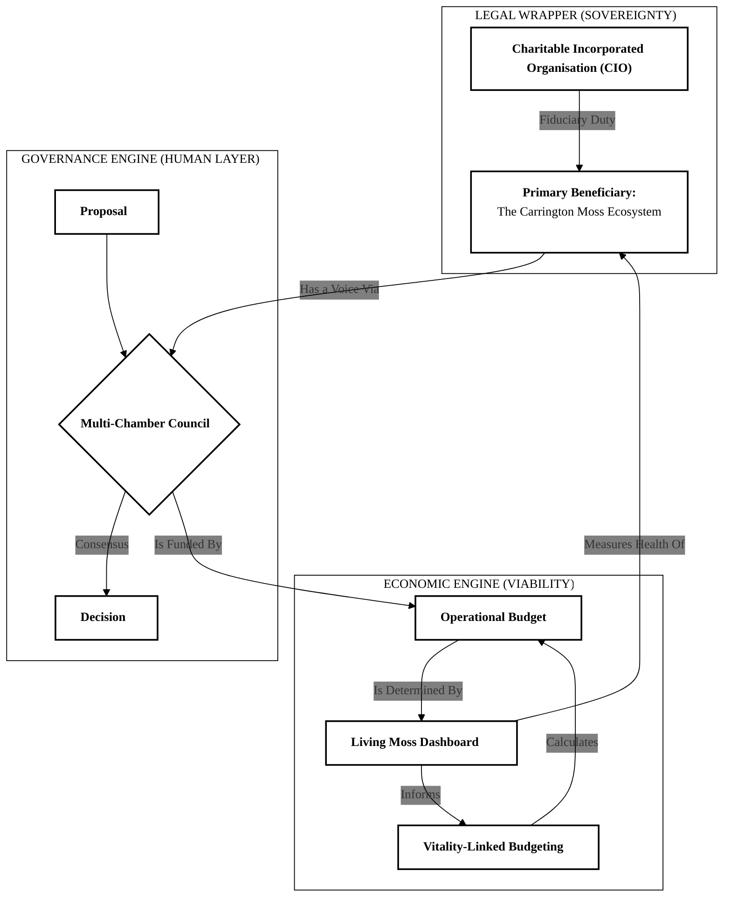

# **From Community Wisdom to a Living Constitution**

### *A Proposal for the Future of Carrington Moss*

---

## **Introduction: A Journey from Listening to Action**

This document summarizes our collective journey to find a regenerative future for Carrington Moss.

Faced with intense development pressure, we chose a path of deep listening. We gathered the stories of the land and its people to understand the true nature of this place.

This process has led to a concrete, powerful, and viable proposal for a new form of governance: **The Carrington Moss Guardianship Trust.**

This is a blueprint for a future where the health of the Moss and the well-being of the community are one and the same.

---

## **Our Four-Stage Process**

---

### **Stage 1: Listening to the Story of Place**

We began by honoring the principle of *"plural wisdoms."*

Through workshops, story circles, and walks on the land, we listened to:

* The memories of the **Elders**
* The aspirations of the **Young Returnees**
* The systemic challenges faced by **Municipal Staff**
* The silent, resilient voice of the **non-human world**

This allowed us to understand the deep history of the Moss — from a **living commons** to a **site of industrial extraction** — and the complex web of tensions it faces today.

---

### **Stage 2: Synthesizing the Wisdom & Discovering the Essence**

We wove together the threads from our listening sessions to identify the **core patterns and truths** of this place.

From this synthesis, a powerful *“place essence”* emerged — a guiding star validated by all stakeholders:

> **“*Carrington Moss is a recovering being inviting kinship, teaching its people to repair through care*.”**

This understanding reframed the Moss not as a problem to be solved or a site to be developed, but as a **living partner in its own regeneration.**

---

### **Stage 3: Designing the Intervention**

With this essence as our guide, we designed the core intervention:

a **"Regenerative Exchange Framework"** where **economic activity is directly tied to ecological restoration.**

This led to the vision of the **Carrington Moss Guardianship Trust** —a **legal and governance body** designed to shift power from speculative developers to a  **place-based stewardship council** , whose primary purpose is to *“accompany the healing”* of the Moss.

---

## **Stage 4: The Proposed Governance Architecture**

The central task was to translate our shared vision into an **enforceable, self-defending structure.**

The proposed model for the Guardianship Trust is built on **three core mechanisms** designed to solve the primary crises facing the Moss.

---

### **1. The Legal Foundation: Giving the Moss a Voice in Law**

**The Challenge:**

UK law does not recognize ecosystems as legal entities with rights.

**The Proposed Mechanism:**

The Trust will be established as a **Charitable Incorporated Organisation (CIO)** — a recognized legal structure.

Crucially, its constitution will name the **Carrington Moss ecosystem as the primary beneficiary.**

**Why This Works:**

A charity has a strict, legally enforceable fiduciary duty to act in the best interests of its beneficiary.

By making the Moss the beneficiary, the Trust’s directors are **legally obligated to act as its fiercest defenders.**

This gives the Moss **de facto rights** and a powerful **legal shield** using existing law.

---

### **2. The Decision-Making Heart: A Council of Kinship**

**The Challenge:**

How to weave together the diverse wisdoms of the community and the land into a coherent and fair decision-making body.

**The Proposed Mechanism:**

A **Multi-Chamber Governance Council** where decisions require consensus.

It includes chambers for:

* **Elders**
* **Youth Innovators**
* **Institutional Stewards**
* And a fourth, most critical vote — the **Guardian for the Moss.**

This last vote is not a human opinion, but a **data-driven veto** based on the real-time health of the Moss.

**Why This Works:**

If a proposal has a high ecological impact and the Moss’s vital signs (e.g., water table, biodiversity) are below a healthy, pre-agreed threshold, the Guardian automatically blocks the proposal.

This translates the principle of *“listening to the Moss”* into a  **non-negotiable rule**, ensuring human aspirations are always held in check by **ecological reality.**

---

### **3. The Economic Engine: An Economy of Care**

**The Challenge:**

How to create a financial model where restoring the Moss is more valuable than developing it.

**The Proposed Mechanism:**

A **"Vitality-Linked Economic Framework"** powered by a public **"Living Moss Dashboard"** that tracks the ecosystem's health in real time.

**Why This Works:**

The Trust’s operational budget and asset value are directly tied to the **health indicators** on the dashboard.

As the Moss gets healthier, the Trust’s **Natural Capital Index** increases, unlocking more funding for community stewardship and regenerative enterprises.

This creates a powerful, **self-reinforcing cycle:**

> The more we care for the Moss, the more resources we have to continue our work.

It makes **ecological repair the engine of our shared prosperity.**

---

## **Next Steps: An Invitation to Co-Create**

This proposal is a  **robust blueprint** , born from the wisdom of this community.

It is now presented back to you — not as a final plan — but as a **powerful tool for the next stage of our journey.**

We invite your **feedback, insights, and collaboration** as we work to make this vision a reality.

### Final System Diagram

### The Meta-Pattern: How This System Solves Problems

The system's "signature move" or meta-pattern can be distilled into a repeatable thinking process:

1. **Embody the Place:** Ingest and synthesize the unique history, ecology, and cultural essence of the place (`__init__`, `analyze_historical_layers`).
2. **Translate Essence into Structure:** Reframe the core problem by designing a legal and governance architecture that gives the place-essence real power (e.g., the CIO with the Moss as beneficiary).
3. **Create Feedback Loops:** Design mechanisms that link the health of the living system directly to the power and resources of the human system (the Dashboard, Vitality-Linked Budgeting, and the Ecological Veto).
4. **Dialectically Harden:** Use iterative, multi-layered critique to identify and close vulnerabilities, moving from fixing simple bugs to refining deep architectural logic.
5. **Identify the Human Role:** Recognize the limits of its own logic and create clear "interfaces" where human wisdom and collective decision-making are required (e.g., setting the veto thresholds).
