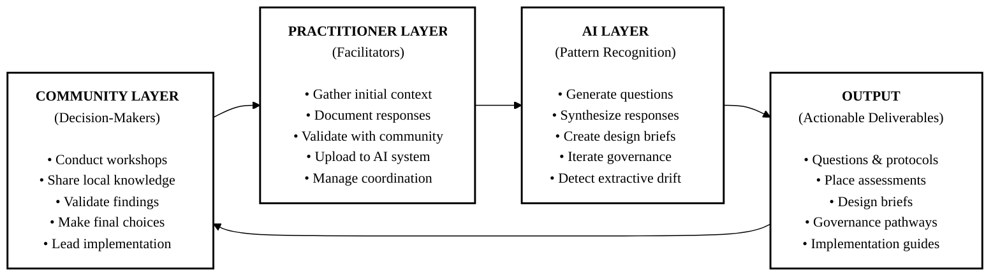
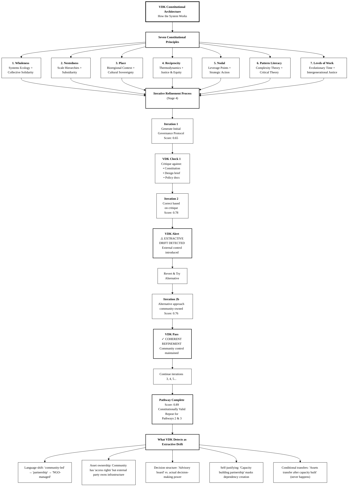

# Main Process Flow Diagram

```mermaid
%%{init: {"theme": "base", "themeVariables": {
  "primaryColor": "transparent",
  "tertiaryColor": "transparent",
  "edgeLabelBackground":"transparent",
  "fontFamily": "Inter, Helvetica, Arial, sans-serif",
  "fontSize": "15px",
  "lineColor": "#000",
  "textColor": "#000"
}}}%%
graph TD
    Start["<b>Community Need<br/>or Challenge</b>"]
  
    S1["<b>STAGE 1:<br/>Generate Inquiry Questions</b>"]
    S1_P["Practitioner:<br/>• Project context<br/>• Place tensions<br/>• Stakeholder types"]
    S1_AI["AI:<br/>• 15-20 questions per group<br/>• Workshop protocol"]
    S1_Out["Output:<br/>Story of Place questions<br/>ready for workshops"]
    S1_C["Community:<br/>Conduct workshops<br/>Document responses<br/>Share stories"]
  
    S2["<b>STAGE 2:<br/>Process Stakeholder Responses</b>"]
    S2_P["Practitioner:<br/>• Workshop transcripts<br/>• Stakeholder quotes<br/>• Initial essence hypothesis"]
    S2_AI["AI:<br/>• Essential Processes assessment<br/>• Refined place essence<br/>• Priority interventions"]
    S2_Out["Output:<br/>Place intelligence assessment<br/>with confidence level"]
    S2_C["Community:<br/>Validate essence<br/>Approve or request changes<br/>Confirm priorities"]
  
    Decision{"<b>Essence<br/>Validated?</b>"}
    MoreInquiry["More Community<br/>Inquiry Needed"]
  
    S3["<b>STAGE 3:<br/>Generate Design Brief</b>"]
    S3_P["Practitioner:<br/>• Validated essence<br/>• Proposed intervention<br/>• Stakeholder commitments"]
    S3_AI["AI:<br/>• Design principles<br/>• Three Spheres analysis<br/>• Nested scales view<br/>• Success metrics"]
    S3_Out["Output:<br/>Complete design brief<br/>for architects and designers"]
    S3_C["Community + Design Team:<br/>Co-design workshops<br/>Refine<br/>Prepare for implementation"]
  
    S4["<b>STAGE 4:<br/>Governance Harmonization</b><br/><b>(VDK-Enhanced)</b>"]
    S4_P["Practitioner:<br/>• Design brief<br/>• Policy documents<br/>• Regulations (PDFs)<br/>• Constitution selection"]
    S4_VDK["VDK Iterative Process:<br/>1. Generate protocol<br/>2. Critique vs docs<br/>3. Check for drift<br/>4. Correct & Loop 5x"]
    S4_Out["Output:<br/>3+ Governance pathways<br/>with pros/cons<br/>and capture risks"]
    S4_C["Community:<br/>Review 3+ pathways<br/>Choose based on context<br/>Implement"]
  
    Implementation["<b>Implementation Phase</b>"]
  
    Start --> S1
    S1 --> S1_P
    S1_P --> S1_AI
    S1_AI --> S1_Out
    S1_Out --> S1_C
    S1_C --> S2
  
    S2 --> S2_P
    S2_P --> S2_AI
    S2_AI --> S2_Out
    S2_Out --> S2_C
    S2_C --> Decision
  
    Decision -->|Yes| S3
    Decision -->|No| MoreInquiry
    MoreInquiry --> S1_C
  
    S3 --> S3_P
    S3_P --> S3_AI
    S3_AI --> S3_Out
    S3_Out --> S3_C
    S3_C --> S4
  
    S4 --> S4_P
    S4_P --> S4_VDK
    S4_VDK --> S4_Out
    S4_Out --> S4_C
    S4_C --> Implementation
  
    style Start stroke:#000,stroke-width:2px,fill:transparent,color:#000
    style S1 stroke:#000,stroke-width:3px,fill:transparent,color:#000
    style S1_P stroke:#000,stroke-width:1px,fill:transparent,color:#000
    style S1_AI stroke:#000,stroke-width:1px,fill:transparent,color:#000
    style S1_Out stroke:#000,stroke-width:1px,fill:transparent,color:#000
    style S1_C stroke:#000,stroke-width:1px,fill:transparent,color:#000
    style S2 stroke:#000,stroke-width:3px,fill:transparent,color:#000
    style S2_P stroke:#000,stroke-width:1px,fill:transparent,color:#000
    style S2_AI stroke:#000,stroke-width:1px,fill:transparent,color:#000
    style S2_Out stroke:#000,stroke-width:1px,fill:transparent,color:#000
    style S2_C stroke:#000,stroke-width:1px,fill:transparent,color:#000
    style Decision stroke:#000,stroke-width:2px,fill:transparent,color:#000
    style MoreInquiry stroke:#000,stroke-width:1px,fill:transparent,color:#000
    style S3 stroke:#000,stroke-width:3px,fill:transparent,color:#000
    style S3_P stroke:#000,stroke-width:1px,fill:transparent,color:#000
    style S3_AI stroke:#000,stroke-width:1px,fill:transparent,color:#000
    style S3_Out stroke:#000,stroke-width:1px,fill:transparent,color:#000
    style S3_C stroke:#000,stroke-width:1px,fill:transparent,color:#000
    style S4 stroke:#000,stroke-width:3px,fill:transparent,color:#000
    style S4_P stroke:#000,stroke-width:1px,fill:transparent,color:#000
    style S4_VDK stroke:#000,stroke-width:1px,fill:transparent,color:#000
    style S4_Out stroke:#000,stroke-width:1px,fill:transparent,color:#000
    style S4_C stroke:#000,stroke-width:1px,fill:transparent,color:#000
    style Implementation stroke:#000,stroke-width:2px,fill:transparent,color:#000
```

# Actor Interaction Layers Diagram

```mermaid
%%{init: {"theme": "base", "themeVariables": {
  "primaryColor": "transparent",
  "tertiaryColor": "transparent",
  "edgeLabelBackground":"transparent",
  "fontFamily": "Inter, Helvetica, Arial, sans-serif",
  "fontSize": "15px",
  "lineColor": "#000",
  "textColor": "#000"
}}}%%
graph LR
    A["<b>COMMUNITY LAYER</b><br/>(Decision-Makers)<br/><br/>• Conduct workshops<br/>• Share local knowledge<br/>• Validate findings<br/>• Make final choices<br/>• Lead implementation"]
  
    B["<b>PRACTITIONER LAYER</b><br/>(Facilitators)<br/><br/>• Gather initial context<br/>• Document responses<br/>• Validate with community<br/>• Upload to AI system<br/>• Manage coordination"]
  
    C["<b>AI LAYER</b><br/>(Pattern Recognition)<br/><br/>• Generate questions<br/>• Synthesize responses<br/>• Create design briefs<br/>• Iterate governance<br/>• Detect extractive drift"]
  
    D["<b>OUTPUT</b><br/>(Actionable Deliverables)<br/><br/>• Questions & protocols<br/>• Place assessments<br/>• Design briefs<br/>• Governance pathways<br/>• Implementation guides"]
  
    A --> B
    B --> C
    C --> D
    D --> A
  
    style A stroke:#000,stroke-width:2px,fill:transparent,color:#000
    style B stroke:#000,stroke-width:2px,fill:transparent,color:#000
    style C stroke:#000,stroke-width:2px,fill:transparent,color:#000
    style D stroke:#000,stroke-width:2px,fill:transparent,color:#000
```

# VDK Constitutional Architecture Diagram

```mermaid
%%{init: {"theme": "base", "themeVariables": {
  "primaryColor": "transparent",
  "tertiaryColor": "transparent",
  "edgeLabelBackground":"transparent",
  "fontFamily": "Inter, Helvetica, Arial, sans-serif",
  "fontSize": "15px",
  "lineColor": "#000",
  "textColor": "#000"
}}}%%
graph TD
    Title["<b>VDK Constitutional Architecture</b><br/>How the System Works"]
  
    Principles["<b>Seven Constitutional Principles</b>"]
    P1["<b>1. Wholeness</b><br/>Systems Ecology +<br/>Collective Solidarity"]
    P2["<b>2. Nestedness</b><br/>Scale Hierarchies +<br/>Subsidiarity"]
    P3["<b>3. Place</b><br/>Bioregional Context +<br/>Cultural Sovereignty"]
    P4["<b>4. Reciprocity</b><br/>Thermodynamics +<br/>Justice & Equity"]
    P5["<b>5. Nodal</b><br/>Leverage Points +<br/>Strategic Action"]
    P6["<b>6. Pattern Literacy</b><br/>Complexity Theory +<br/>Critical Theory"]
    P7["<b>7. Levels of Work</b><br/>Evolutionary Time +<br/>Intergenerational Justice"]
  
    Process["<b>Iterative Refinement Process</b><br/>(Stage 4)"]
  
    I1["<b>Iteration 1</b><br/>Generate Initial<br/>Governance Protocol<br/>Score: 0.65"]
  
    C1["<b>VDK Check 1</b><br/>Critique against:<br/>• Constitution<br/>• Design brief<br/>• Policy docs"]
  
    I2["<b>Iteration 2</b><br/>Correct based<br/>on critique<br/>Score: 0.78"]
  
    C2["<b>VDK Alert</b><br/>⚠️ EXTRACTIVE<br/>DRIFT DETECTED<br/>External control<br/>introduced"]
  
    Revert["Revert & Try<br/>Alternative"]
  
    I2b["<b>Iteration 2b</b><br/>Alternative approach<br/>community-owned<br/>Score: 0.76"]
  
    C2b["<b>VDK Pass</b><br/>✓ COHERENT<br/>REFINEMENT<br/>Community control<br/>maintained"]
  
    Cont["Continue iterations<br/>3, 4, 5..."]
  
    Final["<b>Pathway Complete</b><br/>Score: 0.89<br/>Constitutionally Valid<br/>Repeat for<br/>Pathways 2 & 3"]
  
    Explain["<b>What VDK Detects as Extractive Drift</b>"]
    E1["Language shift: 'community-led' → 'partnership' → 'NGO-managed'"]
    E2["Asset ownership: Community has 'access rights' but external party owns infrastructure"]
    E3["Decision structure: 'Advisory board' vs. actual decision-making power"]
    E4["Self-justifying: 'Capacity building partnership' masks dependency creation"]
    E5["Conditional transfers: 'Assets transfer after capacity built' (never happens)"]
  
    Title --> Principles
    Principles --> P1
    Principles --> P2
    Principles --> P3
    Principles --> P4
    Principles --> P5
    Principles --> P6
    Principles --> P7
  
    P1 --> Process
    P2 --> Process
    P3 --> Process
    P4 --> Process
    P5 --> Process
    P6 --> Process
    P7 --> Process
  
    Process --> I1
    I1 --> C1
    C1 --> I2
    I2 --> C2
    C2 --> Revert
    Revert --> I2b
    I2b --> C2b
    C2b --> Cont
    Cont --> Final
  
    Final --> Explain
    Explain --> E1
    Explain --> E2
    Explain --> E3
    Explain --> E4
    Explain --> E5
  
    style Title stroke:#000,stroke-width:3px,fill:transparent,color:#000
    style Principles stroke:#000,stroke-width:2px,fill:transparent,color:#000
    style P1 stroke:#000,stroke-width:1px,fill:transparent,color:#000
    style P2 stroke:#000,stroke-width:1px,fill:transparent,color:#000
    style P3 stroke:#000,stroke-width:1px,fill:transparent,color:#000
    style P4 stroke:#000,stroke-width:1px,fill:transparent,color:#000
    style P5 stroke:#000,stroke-width:1px,fill:transparent,color:#000
    style P6 stroke:#000,stroke-width:1px,fill:transparent,color:#000
    style P7 stroke:#000,stroke-width:1px,fill:transparent,color:#000
    style Process stroke:#000,stroke-width:2px,fill:transparent,color:#000
    style I1 stroke:#000,stroke-width:1px,fill:transparent,color:#000
    style C1 stroke:#000,stroke-width:1px,fill:transparent,color:#000
    style I2 stroke:#000,stroke-width:1px,fill:transparent,color:#000
    style C2 stroke:#000,stroke-width:2px,fill:transparent,color:#000
    style Revert stroke:#000,stroke-width:1px,fill:transparent,color:#000
    style I2b stroke:#000,stroke-width:1px,fill:transparent,color:#000
    style C2b stroke:#000,stroke-width:2px,fill:transparent,color:#000
    style Cont stroke:#000,stroke-width:1px,fill:transparent,color:#000
    style Final stroke:#000,stroke-width:2px,fill:transparent,color:#000
    style Explain stroke:#000,stroke-width:2px,fill:transparent,color:#000
    style E1 stroke:#000,stroke-width:1px,fill:transparent,color:#000
    style E2 stroke:#000,stroke-width:1px,fill:transparent,color:#000
    style E3 stroke:#000,stroke-width:1px,fill:transparent,color:#000
    style E4 stroke:#000,stroke-width:1px,fill:transparent,color:#000
    style E5 stroke:#000,stroke-width:1px,fill:transparent,color:#000
```

# Seven Constitutional Principles Diagram

```mermaid
%%{init: {"theme": "base", "themeVariables": {
  "primaryColor": "transparent",
  "tertiaryColor": "transparent",
  "edgeLabelBackground":"transparent",
  "fontFamily": "Inter, Helvetica, Arial, sans-serif",
  "fontSize": "15px",
  "lineColor": "#000",
  "textColor": "#000"
}}}%%
graph TB
    Center["<b>VDK Constitutional<br/>Framework</b>"]
  
    P1["<b>Wholeness</b><br/><br/>Systems Ecology +<br/>Collective Solidarity<br/><br/>All parts interconnected<br/>Honors both ecological<br/>and social systems"]
  
    P2["<b>Nestedness</b><br/><br/>Scale Hierarchies +<br/>Subsidiarity<br/><br/>Decisions at appropriate<br/>scale. Local decisions<br/>remain local."]
  
    P3["<b>Place</b><br/><br/>Bioregional Context +<br/>Cultural Sovereignty<br/><br/>Rooted in specific<br/>ecological & cultural<br/>context"]
  
    P4["<b>Reciprocity</b><br/><br/>Thermodynamics +<br/>Justice & Equity<br/><br/>Fair exchange<br/>regenerates all parties<br/>No extraction"]
  
    P5["<b>Nodal</b><br/><br/>Leverage Points +<br/>Strategic Action<br/><br/>Identifies where<br/>intervention has<br/>maximum effect"]
  
    P6["<b>Pattern Literacy</b><br/><br/>Complexity Theory +<br/>Critical Theory<br/><br/>Reads patterns in<br/>systems & power<br/>dynamics"]
  
    P7["<b>Levels of Work</b><br/><br/>Evolutionary Time +<br/>Intergenerational Justice<br/><br/>Actions honoring both<br/>immediate needs and<br/>future generations"]
  
    Center --> P1
    Center --> P2
    Center --> P3
    Center --> P4
    Center --> P5
    Center --> P6
    Center --> P7
  
    style Center stroke:#000,stroke-width:3px,fill:transparent,color:#000
    style P1 stroke:#000,stroke-width:2px,fill:transparent,color:#000
    style P2 stroke:#000,stroke-width:2px,fill:transparent,color:#000
    style P3 stroke:#000,stroke-width:2px,fill:transparent,color:#000
    style P4 stroke:#000,stroke-width:2px,fill:transparent,color:#000
    style P5 stroke:#000,stroke-width:2px,fill:transparent,color:#000
    style P6 stroke:#000,stroke-width:2px,fill:transparent,color:#000
    style P7 stroke:#000,stroke-width:2px,fill:transparent,color:#000
```
