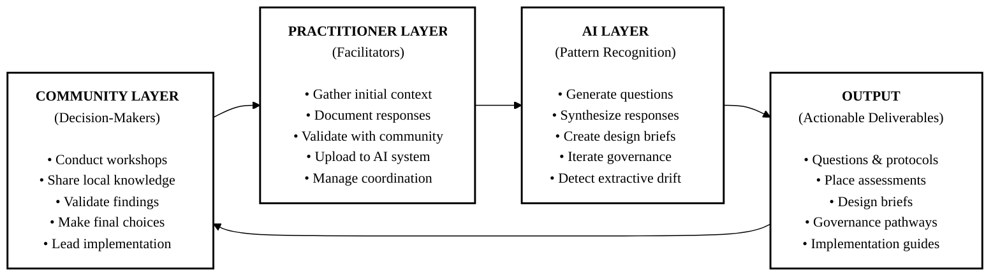

# Actor Interaction Layers Diagram

```mermaid
%%{init: {"theme": "base", "themeVariables": {
  "primaryColor": "transparent",
  "tertiaryColor": "transparent",
  "edgeLabelBackground":"transparent",
  "fontFamily": "Inter, Helvetica, Arial, sans-serif",
  "fontSize": "15px",
  "lineColor": "#000",
  "textColor": "#000"
}}}%%
graph LR
    A["<b>COMMUNITY LAYER</b><br/>(Decision-Makers)<br/><br/>• Conduct workshops<br/>• Share local knowledge<br/>• Validate findings<br/>• Make final choices<br/>• Lead implementation"]
  
    B["<b>PRACTITIONER LAYER</b><br/>(Facilitators)<br/><br/>• Gather initial context<br/>• Document responses<br/>• Validate with community<br/>• Upload to AI system<br/>• Manage coordination"]
  
    C["<b>AI LAYER</b><br/>(Pattern Recognition)<br/><br/>• Generate questions<br/>• Synthesize responses<br/>• Create design briefs<br/>• Iterate governance<br/>• Detect extractive drift"]
  
    D["<b>OUTPUT</b><br/>(Actionable Deliverables)<br/><br/>• Questions & protocols<br/>• Place assessments<br/>• Design briefs<br/>• Governance pathways<br/>• Implementation guides"]
  
    A --> B
    B --> C
    C --> D
    D --> A
  
    style A stroke:#000,stroke-width:2px,fill:transparent,color:#000
    style B stroke:#000,stroke-width:2px,fill:transparent,color:#000
    style C stroke:#000,stroke-width:2px,fill:transparent,color:#000
    style D stroke:#000,stroke-width:2px,fill:transparent,color:#000
```
