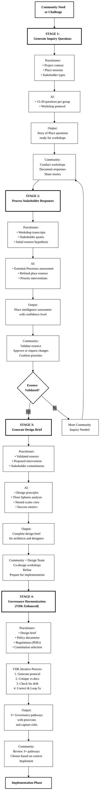

# Main Process Flow Diagram

```mermaid
%%{init: {"theme": "base", "themeVariables": {
  "primaryColor": "transparent",
  "tertiaryColor": "transparent",
  "edgeLabelBackground":"transparent",
  "fontFamily": "Inter, Helvetica, Arial, sans-serif",
  "fontSize": "15px",
  "lineColor": "#000",
  "textColor": "#000"
}}}%%
graph TD
    Start["<b>Community Need<br/>or Challenge</b>"]
  
    S1["<b>STAGE 1:<br/>Generate Inquiry Questions</b>"]
    S1_P["Practitioner:<br/>• Project context<br/>• Place tensions<br/>• Stakeholder types"]
    S1_AI["AI:<br/>• 15-20 questions per group<br/>• Workshop protocol"]
    S1_Out["Output:<br/>Story of Place questions<br/>ready for workshops"]
    S1_C["Community:<br/>Conduct workshops<br/>Document responses<br/>Share stories"]
  
    S2["<b>STAGE 2:<br/>Process Stakeholder Responses</b>"]
    S2_P["Practitioner:<br/>• Workshop transcripts<br/>• Stakeholder quotes<br/>• Initial essence hypothesis"]
    S2_AI["AI:<br/>• Essential Processes assessment<br/>• Refined place essence<br/>• Priority interventions"]
    S2_Out["Output:<br/>Place intelligence assessment<br/>with confidence level"]
    S2_C["Community:<br/>Validate essence<br/>Approve or request changes<br/>Confirm priorities"]
  
    Decision{"<b>Essence<br/>Validated?</b>"}
    MoreInquiry["More Community<br/>Inquiry Needed"]
  
    S3["<b>STAGE 3:<br/>Generate Design Brief</b>"]
    S3_P["Practitioner:<br/>• Validated essence<br/>• Proposed intervention<br/>• Stakeholder commitments"]
    S3_AI["AI:<br/>• Design principles<br/>• Three Spheres analysis<br/>• Nested scales view<br/>• Success metrics"]
    S3_Out["Output:<br/>Complete design brief<br/>for architects and designers"]
    S3_C["Community + Design Team:<br/>Co-design workshops<br/>Refine<br/>Prepare for implementation"]
  
    S4["<b>STAGE 4:<br/>Governance Harmonization</b><br/><b>(VDK-Enhanced)</b>"]
    S4_P["Practitioner:<br/>• Design brief<br/>• Policy documents<br/>• Regulations (PDFs)<br/>• Constitution selection"]
    S4_VDK["VDK Iterative Process:<br/>1. Generate protocol<br/>2. Critique vs docs<br/>3. Check for drift<br/>4. Correct & Loop 5x"]
    S4_Out["Output:<br/>3+ Governance pathways<br/>with pros/cons<br/>and capture risks"]
    S4_C["Community:<br/>Review 3+ pathways<br/>Choose based on context<br/>Implement"]
  
    Implementation["<b>Implementation Phase</b>"]
  
    Start --> S1
    S1 --> S1_P
    S1_P --> S1_AI
    S1_AI --> S1_Out
    S1_Out --> S1_C
    S1_C --> S2
  
    S2 --> S2_P
    S2_P --> S2_AI
    S2_AI --> S2_Out
    S2_Out --> S2_C
    S2_C --> Decision
  
    Decision -->|Yes| S3
    Decision -->|No| MoreInquiry
    MoreInquiry --> S1_C
  
    S3 --> S3_P
    S3_P --> S3_AI
    S3_AI --> S3_Out
    S3_Out --> S3_C
    S3_C --> S4
  
    S4 --> S4_P
    S4_P --> S4_VDK
    S4_VDK --> S4_Out
    S4_Out --> S4_C
    S4_C --> Implementation
  
    style Start stroke:#000,stroke-width:2px,fill:transparent,color:#000
    style S1 stroke:#000,stroke-width:3px,fill:transparent,color:#000
    style S1_P stroke:#000,stroke-width:1px,fill:transparent,color:#000
    style S1_AI stroke:#000,stroke-width:1px,fill:transparent,color:#000
    style S1_Out stroke:#000,stroke-width:1px,fill:transparent,color:#000
    style S1_C stroke:#000,stroke-width:1px,fill:transparent,color:#000
    style S2 stroke:#000,stroke-width:3px,fill:transparent,color:#000
    style S2_P stroke:#000,stroke-width:1px,fill:transparent,color:#000
    style S2_AI stroke:#000,stroke-width:1px,fill:transparent,color:#000
    style S2_Out stroke:#000,stroke-width:1px,fill:transparent,color:#000
    style S2_C stroke:#000,stroke-width:1px,fill:transparent,color:#000
    style Decision stroke:#000,stroke-width:2px,fill:transparent,color:#000
    style MoreInquiry stroke:#000,stroke-width:1px,fill:transparent,color:#000
    style S3 stroke:#000,stroke-width:3px,fill:transparent,color:#000
    style S3_P stroke:#000,stroke-width:1px,fill:transparent,color:#000
    style S3_AI stroke:#000,stroke-width:1px,fill:transparent,color:#000
    style S3_Out stroke:#000,stroke-width:1px,fill:transparent,color:#000
    style S3_C stroke:#000,stroke-width:1px,fill:transparent,color:#000
    style S4 stroke:#000,stroke-width:3px,fill:transparent,color:#000
    style S4_P stroke:#000,stroke-width:1px,fill:transparent,color:#000
    style S4_VDK stroke:#000,stroke-width:1px,fill:transparent,color:#000
    style S4_Out stroke:#000,stroke-width:1px,fill:transparent,color:#000
    style S4_C stroke:#000,stroke-width:1px,fill:transparent,color:#000
    style Implementation stroke:#000,stroke-width:2px,fill:transparent,color:#000
```
