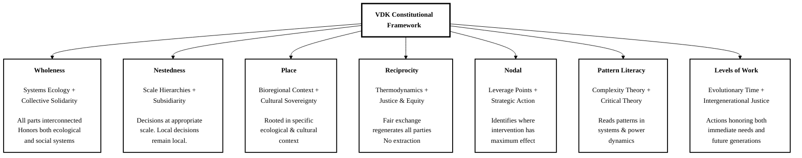

# Seven Constitutional Principles Diagram

```mermaid
%%{init: {"theme": "base", "themeVariables": {
  "primaryColor": "transparent",
  "tertiaryColor": "transparent",
  "edgeLabelBackground":"transparent",
  "fontFamily": "Inter, Helvetica, Arial, sans-serif",
  "fontSize": "15px",
  "lineColor": "#000",
  "textColor": "#000"
}}}%%
graph TB
    Center["<b>VDK Constitutional<br/>Framework</b>"]
  
    P1["<b>Wholeness</b><br/><br/>Systems Ecology +<br/>Collective Solidarity<br/><br/>All parts interconnected<br/>Honors both ecological<br/>and social systems"]
  
    P2["<b>Nestedness</b><br/><br/>Scale Hierarchies +<br/>Subsidiarity<br/><br/>Decisions at appropriate<br/>scale. Local decisions<br/>remain local."]
  
    P3["<b>Place</b><br/><br/>Bioregional Context +<br/>Cultural Sovereignty<br/><br/>Rooted in specific<br/>ecological & cultural<br/>context"]
  
    P4["<b>Reciprocity</b><br/><br/>Thermodynamics +<br/>Justice & Equity<br/><br/>Fair exchange<br/>regenerates all parties<br/>No extraction"]
  
    P5["<b>Nodal</b><br/><br/>Leverage Points +<br/>Strategic Action<br/><br/>Identifies where<br/>intervention has<br/>maximum effect"]
  
    P6["<b>Pattern Literacy</b><br/><br/>Complexity Theory +<br/>Critical Theory<br/><br/>Reads patterns in<br/>systems & power<br/>dynamics"]
  
    P7["<b>Levels of Work</b><br/><br/>Evolutionary Time +<br/>Intergenerational Justice<br/><br/>Actions honoring both<br/>immediate needs and<br/>future generations"]
  
    Center --> P1
    Center --> P2
    Center --> P3
    Center --> P4
    Center --> P5
    Center --> P6
    Center --> P7
  
    style Center stroke:#000,stroke-width:3px,fill:transparent,color:#000
    style P1 stroke:#000,stroke-width:2px,fill:transparent,color:#000
    style P2 stroke:#000,stroke-width:2px,fill:transparent,color:#000
    style P3 stroke:#000,stroke-width:2px,fill:transparent,color:#000
    style P4 stroke:#000,stroke-width:2px,fill:transparent,color:#000
    style P5 stroke:#000,stroke-width:2px,fill:transparent,color:#000
    style P6 stroke:#000,stroke-width:2px,fill:transparent,color:#000
    style P7 stroke:#000,stroke-width:2px,fill:transparent,color:#000
```
