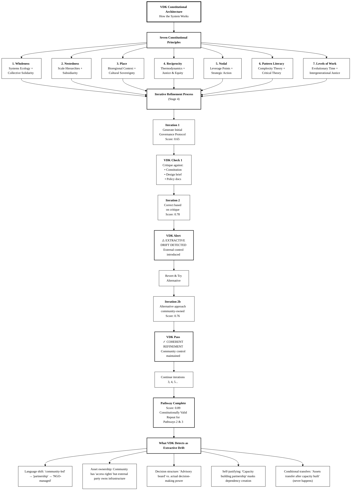

# VDK Constitutional Architecture Diagram

```mermaid
%%{init: {"theme": "base", "themeVariables": {
  "primaryColor": "transparent",
  "tertiaryColor": "transparent",
  "edgeLabelBackground":"transparent",
  "fontFamily": "Inter, Helvetica, Arial, sans-serif",
  "fontSize": "15px",
  "lineColor": "#000",
  "textColor": "#000"
}}}%%
graph TD
    Title["<b>VDK Constitutional Architecture</b><br/>How the System Works"]
  
    Principles["<b>Seven Constitutional Principles</b>"]
    P1["<b>1. Wholeness</b><br/>Systems Ecology +<br/>Collective Solidarity"]
    P2["<b>2. Nestedness</b><br/>Scale Hierarchies +<br/>Subsidiarity"]
    P3["<b>3. Place</b><br/>Bioregional Context +<br/>Cultural Sovereignty"]
    P4["<b>4. Reciprocity</b><br/>Thermodynamics +<br/>Justice & Equity"]
    P5["<b>5. Nodal</b><br/>Leverage Points +<br/>Strategic Action"]
    P6["<b>6. Pattern Literacy</b><br/>Complexity Theory +<br/>Critical Theory"]
    P7["<b>7. Levels of Work</b><br/>Evolutionary Time +<br/>Intergenerational Justice"]
  
    Process["<b>Iterative Refinement Process</b><br/>(Stage 4)"]
  
    I1["<b>Iteration 1</b><br/>Generate Initial<br/>Governance Protocol<br/>Score: 0.65"]
  
    C1["<b>VDK Check 1</b><br/>Critique against:<br/>• Constitution<br/>• Design brief<br/>• Policy docs"]
  
    I2["<b>Iteration 2</b><br/>Correct based<br/>on critique<br/>Score: 0.78"]
  
    C2["<b>VDK Alert</b><br/>⚠️ EXTRACTIVE<br/>DRIFT DETECTED<br/>External control<br/>introduced"]
  
    Revert["Revert & Try<br/>Alternative"]
  
    I2b["<b>Iteration 2b</b><br/>Alternative approach<br/>community-owned<br/>Score: 0.76"]
  
    C2b["<b>VDK Pass</b><br/>✓ COHERENT<br/>REFINEMENT<br/>Community control<br/>maintained"]
  
    Cont["Continue iterations<br/>3, 4, 5..."]
  
    Final["<b>Pathway Complete</b><br/>Score: 0.89<br/>Constitutionally Valid<br/>Repeat for<br/>Pathways 2 & 3"]
  
    Explain["<b>What VDK Detects as Extractive Drift</b>"]
    E1["Language shift: 'community-led' → 'partnership' → 'NGO-managed'"]
    E2["Asset ownership: Community has 'access rights' but external party owns infrastructure"]
    E3["Decision structure: 'Advisory board' vs. actual decision-making power"]
    E4["Self-justifying: 'Capacity building partnership' masks dependency creation"]
    E5["Conditional transfers: 'Assets transfer after capacity built' (never happens)"]
  
    Title --> Principles
    Principles --> P1
    Principles --> P2
    Principles --> P3
    Principles --> P4
    Principles --> P5
    Principles --> P6
    Principles --> P7
  
    P1 --> Process
    P2 --> Process
    P3 --> Process
    P4 --> Process
    P5 --> Process
    P6 --> Process
    P7 --> Process
  
    Process --> I1
    I1 --> C1
    C1 --> I2
    I2 --> C2
    C2 --> Revert
    Revert --> I2b
    I2b --> C2b
    C2b --> Cont
    Cont --> Final
  
    Final --> Explain
    Explain --> E1
    Explain --> E2
    Explain --> E3
    Explain --> E4
    Explain --> E5
  
    style Title stroke:#000,stroke-width:3px,fill:transparent,color:#000
    style Principles stroke:#000,stroke-width:2px,fill:transparent,color:#000
    style P1 stroke:#000,stroke-width:1px,fill:transparent,color:#000
    style P2 stroke:#000,stroke-width:1px,fill:transparent,color:#000
    style P3 stroke:#000,stroke-width:1px,fill:transparent,color:#000
    style P4 stroke:#000,stroke-width:1px,fill:transparent,color:#000
    style P5 stroke:#000,stroke-width:1px,fill:transparent,color:#000
    style P6 stroke:#000,stroke-width:1px,fill:transparent,color:#000
    style P7 stroke:#000,stroke-width:1px,fill:transparent,color:#000
    style Process stroke:#000,stroke-width:2px,fill:transparent,color:#000
    style I1 stroke:#000,stroke-width:1px,fill:transparent,color:#000
    style C1 stroke:#000,stroke-width:1px,fill:transparent,color:#000
    style I2 stroke:#000,stroke-width:1px,fill:transparent,color:#000
    style C2 stroke:#000,stroke-width:2px,fill:transparent,color:#000
    style Revert stroke:#000,stroke-width:1px,fill:transparent,color:#000
    style I2b stroke:#000,stroke-width:1px,fill:transparent,color:#000
    style C2b stroke:#000,stroke-width:2px,fill:transparent,color:#000
    style Cont stroke:#000,stroke-width:1px,fill:transparent,color:#000
    style Final stroke:#000,stroke-width:2px,fill:transparent,color:#000
    style Explain stroke:#000,stroke-width:2px,fill:transparent,color:#000
    style E1 stroke:#000,stroke-width:1px,fill:transparent,color:#000
    style E2 stroke:#000,stroke-width:1px,fill:transparent,color:#000
    style E3 stroke:#000,stroke-width:1px,fill:transparent,color:#000
    style E4 stroke:#000,stroke-width:1px,fill:transparent,color:#000
    style E5 stroke:#000,stroke-width:1px,fill:transparent,color:#000
```
